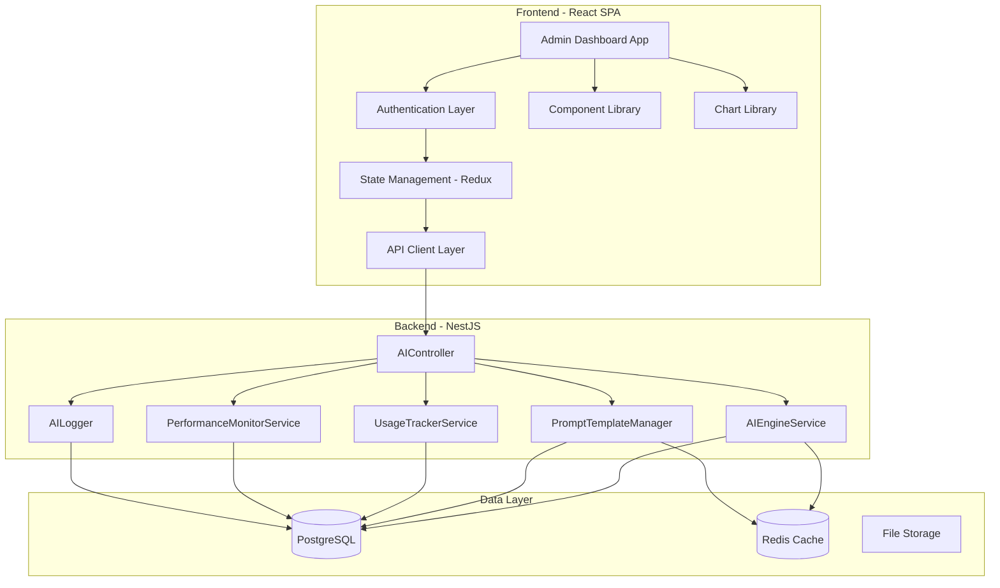

# Admin Dashboard & Management Interface - Design Document

## Overview

The Admin Dashboard & Management Interface is a comprehensive web-based application that provides system administrators with tools to monitor, configure, and manage the AI Resume Optimization platform. The dashboard will be built as a modern single-page application (SPA) using React and TypeScript, leveraging existing backend APIs from the AIController and related services.

The design follows a modular architecture with reusable components, centralized state management, and real-time data updates. The interface prioritizes usability, performance, and accessibility while providing powerful management capabilities for AI models, prompt templates, cost analytics, performance monitoring, and system logs.

## Architecture

### High-Level Architecture



### Technology Stack

**Frontend:**

- React 18+ with TypeScript
- Redux Toolkit for state management
- React Router for navigation
- Axios for HTTP requests
- Recharts or Chart.js for data visualization
- Tailwind CSS for styling
- React Query for server state management and caching
- Socket.io-client for real-time updates (optional)

**Backend (Existing):**

- NestJS with TypeScript
- AIController with comprehensive endpoints
- JWT authentication via JwtAuthGuard
- PostgreSQL for persistent storage
- Redis for caching

### Component Architecture

The dashboard follows a hierarchical component structure:

```
AdminDashboard/
├── Layout/
│   ├── Header (logo, user menu, notifications)
│   ├── Sidebar (navigation menu)
│   └── MainContent (page content area)
├── Pages/
│   ├── Overview (dashboard home)
│   ├── Models (model management)
│   ├── Templates (template management)
│   ├── Costs (cost analytics)
│   ├── Performance (performance monitoring)
│   ├── Logs (log viewer)
│   └── Settings (system settings)
├── Components/
│   ├── Charts/ (reusable chart components)
│   ├── Tables/ (data tables with sorting/filtering)
│   ├── Forms/ (form inputs and validation)
│   ├── Modals/ (dialogs and overlays)
│   └── Common/ (buttons, badges, alerts)
└── Services/
    ├── api.service.ts (API client)
    ├── auth.service.ts (authentication)
    └── websocket.service.ts (real-time updates)
```

## Components and Interfaces

### Core Components

#### 1. Authentication Layer

**Purpose:** Manage user authentication and authorization

**Interface:**

```typescript
interface AuthService {
  login(email: string, password: string): Promise<AuthResponse>;
  logout(): void;
  refreshToken(): Promise<string>;
  isAuthenticated(): boolean;
  hasAdminRole(): boolean;
  getToken(): string | null;
}

interface AuthResponse {
  accessToken: string;
  refreshToken: string;
  user: {
    id: string;
    email: string;
    role: string;
  };
}
```

**Behavior:**

- Stores JWT tokens in localStorage or httpOnly cookies
- Automatically refreshes tokens before expiration
- Redirects to login page when authentication fails
- Includes token in all API requests via interceptor

#### 2. API Client Service

**Purpose:** Centralized HTTP client for backend communication

**Interface:**

```typescript
interface APIClient {
  // Model endpoints
  getModels(provider?: string): Promise<ModelListResponse>;
  getModelInfo(modelName: string): Promise<ModelInfo>;
  reloadModels(): Promise<ReloadResponse>;

  // Template endpoints
  getTemplates(
    scenario?: string,
    provider?: string
  ): Promise<TemplateListResponse>;
  createTemplate(data: CreateTemplateRequest): Promise<Template>;
  getTemplateVersions(scenario: string): Promise<VersionListResponse>;
  rollbackTemplate(scenario: string, version: number): Promise<Template>;
  renderTemplate(data: RenderTemplateRequest): Promise<RenderResponse>;

  // Cost endpoints
  getCostStatistics(params: CostQueryParams): Promise<CostReport>;
  exportCostReport(
    format: 'csv' | 'json',
    params: CostQueryParams
  ): Promise<ExportResponse>;

  // Performance endpoints
  getPerformanceMetrics(
    model?: string,
    startDate?: Date,
    endDate?: Date
  ): Promise<PerformanceMetrics>;
  getPerformanceAlerts(): Promise<AlertListResponse>;

  // Log endpoints
  getLogs(params: LogQueryParams): Promise<LogListResponse>;
  getLogStatistics(params: LogQueryParams): Promise<LogStatistics>;

  // Selection statistics
  getSelectionStatistics(): Promise<SelectionStatistics>;
}
```

**Behavior:**

- Implements request/response interceptors for authentication and error handling
- Provides retry logic for failed requests
- Caches responses where appropriate
- Transforms backend responses to frontend data models

#### 3. State Management (Redux)

**Purpose:** Centralized application state management

**State Structure:**

```typescript
interface RootState {
  auth: AuthState;
  models: ModelsState;
  templates: TemplatesState;
  costs: CostsState;
  performance: PerformanceState;
  logs: LogsState;
  ui: UIState;
}

interface AuthState {
  user: User | null;
  token: string | null;
  isAuthenticated: boolean;
  loading: boolean;
  error: string | null;
}

interface ModelsState {
  models: Model[];
  selectedModel: Model | null;
  loading: boolean;
  error: string | null;
  filters: {
    provider: string | null;
    searchQuery: string;
  };
}

interface TemplatesState {
  templates: Template[];
  selectedTemplate: Template | null;
  versions: TemplateVersion[];
  loading: boolean;
  error: string | null;
}

interface CostsState {
  report: CostReport | null;
  dateRange: DateRange;
  groupBy: 'model' | 'scenario' | 'user';
  loading: boolean;
  error: string | null;
}

interface PerformanceState {
  metrics: PerformanceMetrics | null;
  alerts: Alert[];
  selectedModel: string | null;
  dateRange: DateRange;
  loading: boolean;
  error: string | null;
}

interface LogsState {
  logs: LogEntry[];
  statistics: LogStatistics | null;
  filters: LogFilters;
  pagination: {
    page: number;
    pageSize: number;
    total: number;
  };
  loading: boolean;
  error: string | null;
}

interface UIState {
  sidebarCollapsed: boolean;
  notifications: Notification[];
  theme: 'light' | 'dark';
}
```

**Actions:**

- Async thunks for API calls using Redux Toolkit
- Synchronous actions for UI state updates
- Error handling actions for displaying user feedback

#### 4. Dashboard Layout Component

**Purpose:** Provides consistent layout structure across all pages

**Props:**

```typescript
interface LayoutProps {
  children: React.ReactNode;
}
```

**Structure:**

- Fixed header with logo, breadcrumbs, and user menu
- Collapsible sidebar with navigation menu
- Main content area with page-specific content
- Toast notification container for alerts

#### 5. Overview Page Component

**Purpose:** Display high-level system metrics and status

**Data Requirements:**

- Total active models (from `/ai/models`)
- Total API calls today (from `/ai/logs/stats`)
- Total cost today (from `/ai/cost`)
- Average response time (from `/ai/performance`)
- Recent alerts (from `/ai/performance/alerts`)

**Visualizations:**

- Metric cards with trend indicators
- Recent alerts list with severity badges
- Quick action buttons (reload models, view logs)

#### 6. Model Management Page Component

**Purpose:** Display and manage AI models

**Data Requirements:**

- Model list grouped by provider (from `/ai/models`)
- Model details (from `/ai/models/:modelName`)

**Features:**

- Filterable and searchable model list
- Model status indicators (available/unavailable)
- Model detail modal with configuration
- Reload models button
- Bulk operations (test connection, enable/disable)

**Sub-components:**

- ModelCard: Display individual model information
- ModelDetailModal: Show detailed model configuration
- ModelConfigEditor: Edit model settings

#### 7. Template Management Page Component

**Purpose:** Create, edit, and manage prompt templates

**Data Requirements:**

- Template list (from `/ai/templates`)
- Template versions (from `/ai/templates/:scenario/versions`)

**Features:**

- Template list with search and filters
- Template editor with syntax highlighting
- Variable placeholder detection and validation
- Template preview with sample data
- Version history viewer with diff
- Rollback functionality

**Sub-components:**

- TemplateCard: Display template summary
- TemplateEditor: Rich text editor for template content
- TemplatePreview: Render template with sample variables
- VersionHistory: Display version timeline with diff viewer

#### 8. Cost Analytics Page Component

**Purpose:** Display cost analytics and reports

**Data Requirements:**

- Cost report (from `/ai/cost`)
- Export data (from `/ai/cost/export/:format`)

**Features:**

- Date range picker
- Group by selector (model, scenario, user)
- Cost trend line chart
- Cost distribution pie chart
- Detailed cost breakdown table
- Export to CSV/JSON

**Sub-components:**

- CostChart: Line chart for cost trends
- CostDistribution: Pie chart for cost breakdown
- CostTable: Sortable table with cost details
- ExportButton: Trigger cost report export

#### 9. Performance Monitoring Page Component

**Purpose:** Monitor AI model performance metrics

**Data Requirements:**

- Performance metrics (from `/ai/performance`)
- Performance alerts (from `/ai/performance/alerts`)

**Features:**

- Model selector for filtering
- Date range picker
- Response time trend chart
- Success/failure rate indicators
- Per-model performance table
- Alert list with severity levels

**Sub-components:**

- PerformanceChart: Line chart for response times
- MetricCard: Display individual metrics with trends
- AlertList: Display and manage alerts
- ModelPerformanceTable: Sortable table with model metrics

#### 10. Log Viewer Page Component

**Purpose:** View and search AI operation logs

**Data Requirements:**

- Log entries (from `/ai/logs`)
- Log statistics (from `/ai/logs/stats`)

**Features:**

- Multi-criteria filters (model, provider, scenario, date range)
- Keyword search
- Paginated log list
- Log detail modal
- Log statistics dashboard
- Auto-refresh toggle

**Sub-components:**

- LogFilters: Filter controls for logs
- LogTable: Paginated table with log entries
- LogDetailModal: Display full log details
- LogStatistics: Display aggregated statistics

#### 11. Settings Page Component

**Purpose:** Configure system-wide settings

**Data Requirements:**

- Current settings (stored in frontend state or backend config)

**Features:**

- Performance alert thresholds
- Cost alert thresholds
- Auto-refresh intervals
- Log retention settings
- Theme preferences

**Sub-components:**

- SettingsForm: Form for editing settings
- ThresholdInput: Specialized input for threshold values

## Data Models

### Frontend Data Models

```typescript
// Model types
interface Model {
  name: string;
  provider: string;
  status: 'available' | 'unavailable';
  lastChecked: Date;
  config: ModelConfig;
  cost: CostConfig;
}

interface ModelConfig {
  endpoint: string;
  temperature: number;
  maxTokens: number;
  topP: number;
}

interface CostConfig {
  inputTokenPrice: number;
  outputTokenPrice: number;
}

// Template types
interface Template {
  id: string;
  name: string;
  scenario: string;
  template: string;
  variables: string[];
  provider?: string;
  version: number;
  createdAt: Date;
  updatedAt: Date;
}

interface TemplateVersion {
  version: number;
  template: string;
  modifiedAt: Date;
  modifiedBy: string;
  notes: string;
}

// Cost types
interface CostReport {
  summary: {
    totalCost: number;
    totalCalls: number;
    totalInputTokens: number;
    totalOutputTokens: number;
  };
  breakdown: CostBreakdownItem[];
  trends: CostTrendPoint[];
}

interface CostBreakdownItem {
  key: string; // model name, scenario, or user id
  calls: number;
  inputTokens: number;
  outputTokens: number;
  cost: number;
}

interface CostTrendPoint {
  date: Date;
  cost: number;
}

// Performance types
interface PerformanceMetrics {
  summary: {
    averageResponseTime: number;
    totalRequests: number;
    successRate: number;
    failureRate: number;
  };
  modelMetrics: ModelMetric[];
  trends: PerformanceTrendPoint[];
}

interface ModelMetric {
  modelName: string;
  averageResponseTime: number;
  minResponseTime: number;
  maxResponseTime: number;
  successRate: number;
  failureRate: number;
  totalRequests: number;
}

interface PerformanceTrendPoint {
  timestamp: Date;
  responseTime: number;
}

interface Alert {
  id: string;
  type: 'performance' | 'cost' | 'availability';
  severity: 'critical' | 'warning' | 'info';
  modelName: string;
  metric: string;
  value: number;
  threshold: number;
  timestamp: Date;
  acknowledged: boolean;
}

// Log types
interface LogEntry {
  id: string;
  timestamp: Date;
  model: string;
  provider: string;
  scenario: string;
  status: 'success' | 'failure';
  responseTime: number;
  inputTokens: number;
  outputTokens: number;
  cost: number;
  error?: string;
}

interface LogStatistics {
  totalRequests: number;
  uniqueUsers: number;
  mostUsedModels: { model: string; count: number }[];
  mostCommonScenarios: { scenario: string; count: number }[];
  requestVolume: { timestamp: Date; count: number }[];
  averageResponseTime: number;
}

// Selection statistics types
interface SelectionStatistics {
  statistics: {
    totalSelections: number;
    mostSelectedModel: string;
    selectionSuccessRate: number;
    selectionsByModel: { model: string; count: number }[];
  };
  recentSelections: SelectionLogEntry[];
}

interface SelectionLogEntry {
  timestamp: Date;
  scenario: string;
  selectedModel: string;
  reason: string;
  success: boolean;
}

// UI types
interface Notification {
  id: string;
  type: 'success' | 'error' | 'warning' | 'info';
  message: string;
  timestamp: Date;
  autoDismiss: boolean;
}

interface DateRange {
  startDate: Date;
  endDate: Date;
}

interface LogFilters {
  model?: string;
  provider?: string;
  scenario?: string;
  dateRange: DateRange;
  searchQuery: string;
}
```

## Error Handling

### Error Handling Strategy

**API Error Handling:**

1. Network errors: Display retry option with exponential backoff
2. Authentication errors (401): Redirect to login page
3. Authorization errors (403): Display "Access Denied" message
4. Validation errors (400): Display field-specific error messages
5. Server errors (500): Display generic error message with support contact

**Error Display:**

- Toast notifications for transient errors
- Inline error messages for form validation
- Error boundaries for component-level errors
- Fallback UI for critical failures

**Error Recovery:**

- Automatic retry for network failures (max 3 attempts)
- Manual retry button for failed operations
- Clear error state when user navigates away
- Log errors to console for debugging

### Error Types

```typescript
interface APIError {
  code: string;
  message: string;
  details?: Record<string, any>;
  statusCode: number;
}

interface ValidationError {
  field: string;
  message: string;
}

interface NetworkError {
  message: string;
  retryable: boolean;
}
```

## Testing Strategy

The Admin Dashboard will employ a comprehensive testing strategy combining unit tests, integration tests, and end-to-end tests to ensure correctness and reliability.

### Testing Approach

**Unit Tests:**

- Test individual components in isolation
- Test Redux reducers and actions
- Test utility functions and helpers
- Test API client methods with mocked responses
- Focus on business logic and edge cases

**Integration Tests:**

- Test component interactions
- Test Redux store integration with components
- Test API client integration with backend
- Test form submission flows
- Test navigation and routing

**End-to-End Tests:**

- Test complete user workflows
- Test authentication flow
- Test model management workflow
- Test template creation and editing
- Test cost report generation and export
- Test log viewing and filtering

**Property-Based Tests:**

- Test data transformation functions with random inputs
- Test chart rendering with various data shapes
- Test form validation with generated inputs
- Test pagination logic with different page sizes

### Testing Tools

- Jest for unit and integration tests
- React Testing Library for component tests
- MSW (Mock Service Worker) for API mocking
- Cypress or Playwright for E2E tests
- fast-check for property-based testing

### Test Coverage Goals

- Minimum 80% code coverage for business logic
- 100% coverage for critical paths (authentication, data mutations)
- All user-facing features covered by E2E tests

## Correctness Properties

_A property is a characteristic or behavior that should hold true across all valid executions of a system—essentially, a formal statement about what the system should do. Properties serve as the bridge between human-readable specifications and machine-verifiable correctness guarantees._

### Property 1: Navigation Without Reload

_For any_ navigation item in the sidebar, when clicked, the system should load the corresponding page without triggering a full page reload (SPA behavior).

**Validates: Requirements 1.6**

### Property 2: Data Field Completeness

_For any_ displayed item (model, template, alert, log entry), all required fields specified in the requirements should be present and non-empty in the UI.

**Validates: Requirements 2.2, 4.2, 5.2, 10.2, 11.2**

### Property 3: Click-to-Detail Interaction

_For any_ clickable item in a list (model, template, version, alert, log), clicking it should display a detail view or modal with additional information.

**Validates: Requirements 2.3, 4.5, 5.3, 10.5, 11.6**

### Property 4: Filter Correctness

_For any_ filter applied (provider, scenario, severity, search query), the displayed results should only include items that match the filter criteria.

**Validates: Requirements 2.4, 2.5, 4.8, 10.4, 13.5**

### Property 5: Unavailable Model Warning

_For any_ model with status "unavailable", the UI should display a warning indicator and show the associated error message.

**Validates: Requirements 2.7**

### Property 6: Configuration Form Display

_For any_ model, clicking the "Edit" button should display a configuration form with editable fields.

**Validates: Requirements 3.1**

### Property 7: API Key Masking

_For any_ API key field in the configuration form, the value should be masked by default and only revealed when the user clicks the "Show" button.

**Validates: Requirements 3.3**

### Property 8: Pre-Save Validation

_For any_ configuration save attempt, the system should validate all inputs before making the API call to save changes.

**Validates: Requirements 3.4**

### Property 9: Field-Level Error Display

_For any_ invalid field in a form, the system should display a specific error message next to that field when validation fails.

**Validates: Requirements 3.6, 18.3**

### Property 10: Template Version Creation

_For any_ template save operation, the system should create a new version entry and preserve all previous versions.

**Validates: Requirements 4.7**

### Property 11: Version History Display

_For any_ template, clicking "Version History" should display a list of all versions with complete metadata (version number, time, modifier, notes).

**Validates: Requirements 5.1, 5.2**

### Property 12: Version Diff Display

_For any_ version in the history, clicking it should display a diff view comparing that version to the current version.

**Validates: Requirements 5.3**

### Property 13: Rollback Confirmation

_For any_ version, clicking "Rollback" should prompt the user for confirmation before executing the rollback.

**Validates: Requirements 5.4**

### Property 14: Rollback Execution

_For any_ confirmed rollback operation, the system should restore the selected version as current and create a new version entry documenting the rollback.

**Validates: Requirements 5.5**

### Property 15: Template Variable Input Fields

_For any_ template in the testing interface, the system should display input fields matching all variables defined in the template.

**Validates: Requirements 6.2**

### Property 16: Render Error Highlighting

_For any_ template render failure, the system should display error messages and highlight missing or invalid variables.

**Validates: Requirements 6.5**

### Property 17: Cost Table Default Sort

_For any_ cost data loaded, the cost breakdown table should be sorted by total cost in descending order by default.

**Validates: Requirements 7.8**

### Property 18: Export Filter Application

_For any_ cost report export, the system should apply the currently selected date range and grouping filters to the exported data.

**Validates: Requirements 8.3**

### Property 19: Export Error Handling

_For any_ failed export operation, the system should display an error message to the user.

**Validates: Requirements 8.6**

### Property 20: Export Column Completeness

_For any_ exported cost report, all relevant columns (timestamps, model names, token counts, costs) should be included in the output.

**Validates: Requirements 8.7**

### Property 21: Performance Visual Indicators

_For any_ success rate or failure rate displayed, the system should show appropriate visual indicators (green for good, yellow for warning, red for critical).

**Validates: Requirements 9.7**

### Property 22: Performance Threshold Highlighting

_For any_ model with failure rate above 10% or average response time above 30 seconds, the system should highlight it in the performance table.

**Validates: Requirements 9.8**

### Property 23: Alert Sorting

_For any_ list of alerts, the system should sort them first by severity (critical, warning, info) and then by timestamp.

**Validates: Requirements 10.3**

### Property 24: Alert Acknowledgment

_For any_ alert, clicking "Acknowledge" should update its status and move it to the acknowledged alerts list.

**Validates: Requirements 10.7**

### Property 25: Filter Without Reload

_For any_ filter or search applied to logs, the system should update the log list without triggering a full page reload.

**Validates: Requirements 11.5**

### Property 26: Log Pagination

_For any_ log list, the system should paginate results with exactly 50 entries per page.

**Validates: Requirements 11.7**

### Property 27: Smooth Data Updates

_For any_ automatic data refresh, the system should update the display smoothly without disrupting user interaction (no jarring reloads or scroll position changes).

**Validates: Requirements 14.4**

### Property 28: Manual Refresh Availability

_For any_ page in the dashboard, a manual refresh button should be available and functional.

**Validates: Requirements 14.6**

### Property 29: Auto-Update Cleanup

_For any_ page navigation, the system should stop automatic updates for the page being navigated away from.

**Validates: Requirements 14.7**

### Property 30: Responsive Chart Adaptation

_For any_ chart displayed, it should adapt its layout and sizing to the current screen size.

**Validates: Requirements 15.4**

### Property 31: Keyboard Navigation

_For any_ interactive element (button, link, input, dropdown), keyboard navigation should be fully functional.

**Validates: Requirements 15.5**

### Property 32: Color Contrast Compliance

_For any_ text or UI element, the color contrast should meet WCAG AA standards (minimum 4.5:1 for normal text).

**Validates: Requirements 15.6**

### Property 33: Alt Text Presence

_For any_ image or icon, alt text should be provided for screen readers.

**Validates: Requirements 15.7**

### Property 34: Authentication Requirement

_For any_ attempt to access the dashboard, the system should require authentication before granting access.

**Validates: Requirements 16.1**

### Property 35: Invalid Credentials Rejection

_For any_ login attempt with invalid credentials, the system should display an error message and deny access.

**Validates: Requirements 16.3**

### Property 36: Session Expiration Redirect

_For any_ expired session, the system should redirect the user to the login page when they attempt to perform an action.

**Validates: Requirements 16.4**

### Property 37: Admin Role Verification

_For any_ authenticated user without admin role, the system should deny access to the dashboard and display an unauthorized error.

**Validates: Requirements 16.6, 16.7**

### Property 38: Settings Validation

_For any_ setting change, the system should validate the input before allowing it to be saved.

**Validates: Requirements 17.6**

### Property 39: Immediate Settings Application

_For any_ saved settings change, the system should apply the new settings immediately without requiring a restart.

**Validates: Requirements 17.7**

### Property 40: API Error Display

_For any_ failed API call, the system should display a user-friendly error message with specific details about what failed.

**Validates: Requirements 18.1, 18.2**

### Property 41: Success Notification Display

_For any_ successful operation, the system should display a success notification.

**Validates: Requirements 18.4**

### Property 42: Success Notification Auto-Dismiss

_For any_ success notification, the system should automatically dismiss it after exactly 5 seconds.

**Validates: Requirements 18.5**

### Property 43: Error Notification Persistence

_For any_ error notification, the system should keep it visible until the user explicitly dismisses it.

**Validates: Requirements 18.6**

### Property 44: Network Error Retry Option

_For any_ network error, the system should display a retry option to the user.

**Validates: Requirements 18.7**

### Property 45: Chart Type Consistency

_For any_ data visualization, the chart type should match the data pattern (line charts for trends, bar charts for comparisons, pie charts for distributions).

**Validates: Requirements 19.1**

### Property 46: Chart Color Consistency

_For any_ chart displayed, the color scheme should be consistent with other charts in the dashboard.

**Validates: Requirements 19.2**

### Property 47: Chart Tooltip Display

_For any_ chart element hover, the system should display a detailed tooltip with exact values.

**Validates: Requirements 19.3**

### Property 48: Time-Series Chart Interactivity

_For any_ time-series chart, zoom and pan functionality should be available and functional.

**Validates: Requirements 19.4**

### Property 49: Chart Legend Toggles

_For any_ chart with multiple data series, legend toggles should allow showing/hiding individual series.

**Validates: Requirements 19.5**

### Property 50: Chart Loading State

_For any_ chart while data is loading, a loading indicator should be displayed.

**Validates: Requirements 19.6**

### Property 51: Chart Empty State

_For any_ chart with no data, a "No data available" message should be displayed.

**Validates: Requirements 19.7**

### Property 52: Bulk Action Button Display

_For any_ list with selectable items, when one or more items are selected, bulk action buttons should be displayed.

**Validates: Requirements 20.2**

### Property 53: Bulk Action Confirmation

_For any_ bulk action initiated, the system should prompt for confirmation before executing.

**Validates: Requirements 20.3**

### Property 54: Bulk Action Execution

_For any_ confirmed bulk action, the system should execute the action on all selected items and display progress.

**Validates: Requirements 20.4**

### Property 55: Bulk Action Summary

_For any_ completed bulk action, the system should display a summary showing the number of successes and failures.

**Validates: Requirements 20.5**

### Property 56: Template Bulk Operations Parity

_For any_ bulk operation available for models, the same operation should be available for templates with equivalent behavior.

**Validates: Requirements 20.7**
