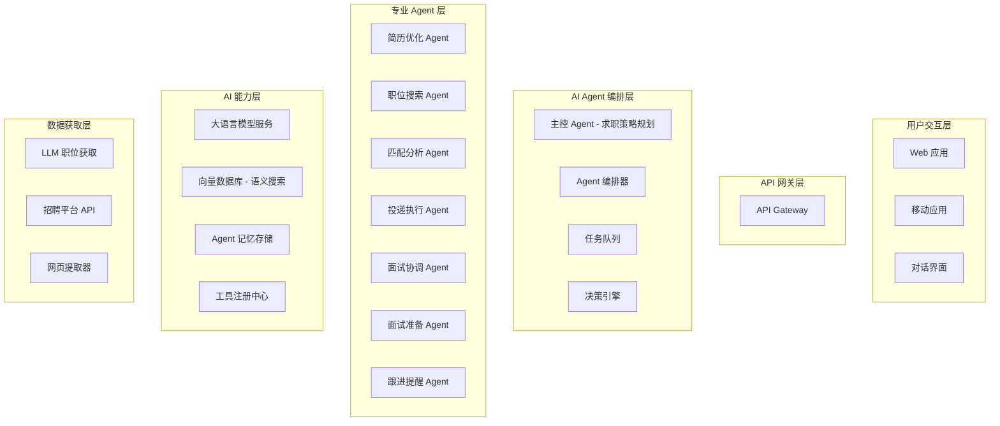
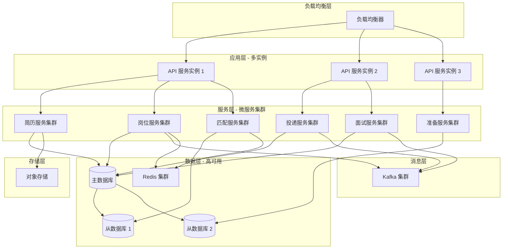

# 设计文档：自动化求职系统

## 概述

自动化求职系统是一个 **AI 全智能代理应用**，通过多个协作的 AI Agent 自主完成从简历优化到成功入职的全流程求职任务。系统的核心是一个智能求职代理（Job Search Agent），它能够理解用户的职业目标，自主规划求职策略，协调多个专业 Agent 执行具体任务，并持续学习优化决策。

**核心理念**：

- **自主决策**：AI Agent 根据用户目标和市场情况自主制定求职计划
- **多 Agent 协作**：简历优化 Agent、职位搜索 Agent、匹配分析 Agent、投递 Agent、面试准备 Agent 等协同工作
- **持续学习**：从用户反馈和求职结果中学习，不断优化策略
- **人机协作**：关键决策点征求用户确认，其他环节自动执行

该系统采用微服务架构，支持高并发处理和横向扩展，确保在处理大量岗位数据和用户请求时保持高性能和可靠性。

## 系统架构



    subgraph "数据存储层"
        UserDB[(用户数据库)]
        JobDB[(岗位数据库)]
        ApplicationDB[(投递记录库)]
        CacheLayer[缓存层 Redis]
        FileStorage[文件存储 S3]
    end

    subgraph "消息队列层"
        MessageQueue[消息队列 Kafka/RabbitMQ]
    end

    WebUI --> Gateway
    MobileUI --> Gateway
    ChatInterface --> Gateway

    Gateway --> MasterAgent
    MasterAgent --> AgentOrchestrator
    MasterAgent --> DecisionEngine

    AgentOrchestrator --> TaskQueue
    AgentOrchestrator --> ResumeAgent
    AgentOrchestrator --> JobSearchAgent
    AgentOrchestrator --> MatchAgent
    AgentOrchestrator --> ApplicationAgent
    AgentOrchestrator --> InterviewAgent
    AgentOrchestrator --> PrepAgent
    AgentOrchestrator --> FollowUpAgent

    ResumeAgent --> LLMService
    ResumeAgent --> FileStorage
    ResumeAgent --> MemoryStore

    JobSearchAgent --> LLMJobFetcher
    JobSearchAgent --> PlatformAPIs
    JobSearchAgent --> WebExtractor
    JobSearchAgent --> VectorDB

    MatchAgent --> LLMService
    MatchAgent --> VectorDB
    MatchAgent --> MemoryStore

    ApplicationAgent --> PlatformAPIs
    ApplicationAgent --> LLMService
    ApplicationAgent --> MessageQueue

    InterviewAgent --> LLMService
    InterviewAgent --> ToolRegistry
    InterviewAgent --> MessageQueue

    PrepAgent --> LLMService
    PrepAgent --> VectorDB
    PrepAgent --> MemoryStore

    FollowUpAgent --> LLMService
    FollowUpAgent --> MessageQueue

    LLMService --> ToolRegistry

    ResumeAgent --> UserDB
    JobSearchAgent --> JobDB
    MatchAgent --> JobDB
    ApplicationAgent --> ApplicationDB
    InterviewAgent --> ApplicationDB
    PrepAgent --> UserDB

````

## 核心组件与接口

### 0. 主控 Agent (Master Job Search Agent)

**职责**：
- 理解用户的职业目标和求职需求
- 制定整体求职策略和时间规划
- 协调各专业 Agent 的工作
- 监控求职进度并动态调整策略
- 在关键决策点与用户交互确认

**核心能力**：
- **目标理解**：通过对话理解用户的职业目标、期望薪资、工作地点等
- **策略规划**：根据用户背景和市场情况制定求职计划
- **任务分解**：将求职目标分解为可执行的子任务
- **进度监控**：跟踪各 Agent 的执行情况
- **决策优化**：根据反馈调整策略

**接口定义**：

```pascal
INTERFACE MasterJobSearchAgent
  // 初始化求职任务
  initializeJobSearch(userId: UUID, goals: CareerGoals): JobSearchSession

  // 生成求职策略
  generateStrategy(session: JobSearchSession): JobSearchStrategy

  // 执行求职计划
  executeStrategy(strategy: JobSearchStrategy): ExecutionPlan

  // 监控进度
  monitorProgress(session: JobSearchSession): ProgressReport

  // 调整策略
  adjustStrategy(session: JobSearchSession, feedback: Feedback): UpdatedStrategy

  // 与用户对话
  chat(session: JobSearchSession, message: String): AgentResponse
END INTERFACE
````

### 1. 简历优化 Agent (Resume Optimization Agent)

**职责**：

- 自主解析和理解用户简历
- 使用 LLM 深度分析简历质量和竞争力
- 自动生成优化建议并执行改进
- 针对目标岗位自动定制简历版本
- 学习用户偏好和行业最佳实践

**Agent 能力**：

- **语义理解**：理解简历内容的深层含义
- **自主优化**：自动改写和优化简历内容
- **个性化定制**：根据岗位要求生成定制版本
- **持续学习**：从成功案例中学习优化策略

**接口定义**：

```pascal
INTERFACE ResumeOptimizationAgent
  // Agent 自主分析简历
  analyzeAndOptimize(userId: UUID, resumeFile: File): OptimizationTask

  // 自动生成优化版本
  generateOptimizedVersion(resumeId: ResumeId, targetRole: String): OptimizedResume

  // 针对特定岗位定制
  customizeForJob(resumeId: ResumeId, jobId: JobId): CustomizedResume

  // 学习用户反馈
  learnFromFeedback(resumeId: ResumeId, feedback: UserFeedback): Boolean

  // 导出简历
  exportResume(resumeId: ResumeId, format: ExportFormat): File
END INTERFACE
```

### 2. 职位搜索 Agent (Job Search Agent)

**职责**：

- 自主理解用户的职业目标和技能栈
- 使用 LLM 智能生成搜索策略
- 从多个数据源自动获取和汇总职位
- 实时监控新职位并主动推荐
- 分析职位市场趋势

**Agent 能力**：

- **智能搜索**：根据用户背景自动生成最优搜索策略
- **多源聚合**：整合 API、LLM、网页等多种数据源
- **语义过滤**：使用向量搜索和 LLM 过滤不相关职位
- **市场洞察**：分析职位趋势和薪资水平
- **主动推荐**：发现新职位时主动通知用户

**核心工作流程**：

1. **理解需求**：从简历和对话中提取技能栈和偏好
2. **策略生成**：LLM 生成多维度搜索策略
3. **并行获取**：
   - 调用招聘平台 API（LinkedIn, Indeed, Glassdoor）
   - LLM 从公开数据汇总职位
   - 提取企业官网招聘信息
4. **智能过滤**：向量相似度 + LLM 语义分析
5. **持续监控**：定时检查新职位并推送

**接口定义**：

```pascal
INTERFACE JobSearchAgent
  // Agent 自主搜索职位
  autonomousSearch(userId: UUID, goals: CareerGoals): SearchTask

  // 生成搜索策略
  generateSearchStrategy(userProfile: UserProfile): SearchStrategy

  // 执行搜索任务
  executeSearch(strategy: SearchStrategy): JobList

  // 语义过滤职位
  semanticFilter(jobs: JobList, userProfile: UserProfile): FilteredJobList

  // 分析市场趋势
  analyzeMarket(skills: SkillList, location: Location): MarketInsights

  // 订阅新职位
  subscribeToNewJobs(userId: UUID, criteria: SearchCriteria): SubscriptionId

  // 主动推荐
  proactiveRecommend(userId: UUID): RecommendationList
END INTERFACE
```

### 3. 匹配分析 Agent (Match Analysis Agent)

**职责**：

- 深度分析用户背景与岗位要求的匹配度
- 使用 LLM 生成详细的匹配解释
- 识别技能差距并提供建议
- 预测申请成功率
- 优先级排序和推荐

**Agent 能力**：

- **多维匹配**：技能、经验、教育、文化、薪资等多维度分析
- **语义理解**：理解隐含的技能要求和软技能
- **可解释性**：生成人类可理解的匹配理由
- **预测能力**：基于历史数据预测成功率
- **个性化推荐**：根据用户偏好调整推荐策略

**接口定义**：

```pascal
INTERFACE MatchAnalysisAgent
  // 深度匹配分析
  deepAnalysis(userId: UUID, jobId: JobId): DetailedMatchReport

  // 批量匹配评分
  batchMatch(userId: UUID, jobIds: List<JobId>): MatchScoreList

  // 生成匹配解释
  explainMatch(userId: UUID, jobId: JobId): MatchExplanation

  // 识别技能差距
  identifySkillGaps(userId: UUID, jobId: JobId): SkillGapAnalysis

  // 预测成功率
  predictSuccessRate(userId: UUID, jobId: JobId): SuccessProbability

  // 智能推荐
  intelligentRecommend(userId: UUID, preferences: UserPreferences): RankedJobList
END INTERFACE
```

### 4. 投递执行 Agent (Application Execution Agent)

**职责**：

- 自主决策投递时机和策略
- 自动生成个性化求职信
- 执行自动投递到各平台
- 智能跟踪投递状态
- 优化投递策略

**Agent 能力**：

- **时机判断**：分析最佳投递时间
- **内容生成**：自动生成个性化 Cover Letter
- **多平台投递**：适配不同平台的投递流程
- **状态追踪**：主动检查投递状态变化
- **策略优化**：根据反馈调整投递策略

**接口定义**：

```pascal
INTERFACE ApplicationExecutionAgent
  // 自主决策并投递
  autonomousApply(userId: UUID, jobId: JobId, strategy: ApplicationStrategy): ApplicationTask

  // 生成求职信
  generateCoverLetter(userId: UUID, jobId: JobId): CoverLetter

  // 批量投递
  batchApply(userId: UUID, jobIds: List<JobId>, strategy: BatchStrategy): BatchResult

  // 智能跟踪状态
  trackStatus(applicationId: ApplicationId): StatusUpdate

  // 自动跟进
  autoFollowUp(applicationId: ApplicationId): FollowUpAction

  // 优化投递策略
  optimizeStrategy(userId: UUID, history: ApplicationHistory): OptimizedStrategy
END INTERFACE
```

### 5. 面试协调 Agent (Interview Coordination Agent)

**职责**：

- 自动解析面试邀请邮件
- 智能协调面试时间
- 主动发送提醒和准备建议
- 管理面试反馈
- 同步日历系统

**Agent 能力**：

- **邮件理解**：自动解析面试邀请内容
- **时间协调**：分析用户日程并建议最佳时间
- **主动提醒**：提前提醒并提供准备建议
- **反馈收集**：面试后自动收集和整理反馈
- **日历集成**：自动同步到用户日历

**接口定义**：

```pascal
INTERFACE InterviewCoordinationAgent
  // 解析面试邀请
  parseInvitation(email: Email): InterviewInvitation

  // 智能调度
  intelligentSchedule(invitation: InterviewInvitation, userCalendar: Calendar): ScheduleSuggestion

  // 自动确认
  autoConfirm(interviewId: InterviewId, selectedTime: DateTime): ConfirmationResult

  // 主动提醒
  proactiveRemind(interviewId: InterviewId): ReminderTask

  // 重新安排
  reschedule(interviewId: InterviewId, reason: String): RescheduleTask

  // 收集反馈
  collectFeedback(interviewId: InterviewId): FeedbackCollection
END INTERFACE
```

### 6. 面试准备 Agent (Interview Preparation Agent)

**职责**：

- 自动分析岗位和公司信息
- 生成个性化准备计划
- 提供模拟面试和反馈
- 推荐学习资源
- 跟踪准备进度

**Agent 能力**：

- **深度分析**：分析公司文化、岗位要求、面试官背景
- **计划生成**：根据面试时间自动生成准备计划
- **模拟面试**：使用 LLM 进行模拟面试对话
- **实时反馈**：分析回答质量并提供改进建议
- **资源推荐**：智能推荐学习材料

**接口定义**：

```pascal
INTERFACE InterviewPreparationAgent
  // 自动生成准备计划
  autoGeneratePlan(jobId: JobId, userId: UUID, interviewDate: DateTime): PreparationPlan

  // 深度公司分析
  analyzeCompany(companyId: CompanyId): CompanyInsights

  // 模拟面试
  conductMockInterview(userId: UUID, jobId: JobId, category: InterviewType): MockInterviewSession

  // 评估回答
  evaluateAnswer(question: String, answer: String): AnswerFeedback

  // 智能推荐资源
  recommendResources(userId: UUID, skillGaps: SkillGapList): ResourceList

  // 跟踪进度
  trackProgress(planId: PlanId): ProgressReport
END INTERFACE
```

### 7. 跟进提醒 Agent (Follow-up Agent)

**职责**：

- 自动跟踪投递和面试状态
- 在适当时机主动跟进
- 发送感谢信和跟进邮件
- 提醒用户重要节点
- 管理 offer 谈判

**Agent 能力**：

- **状态监控**：持续监控申请和面试状态
- **时机判断**：判断最佳跟进时间
- **内容生成**：自动生成跟进邮件和感谢信
- **谈判辅助**：提供 offer 谈判建议
- **决策支持**：帮助用户比较多个 offer

**接口定义**：

```pascal
INTERFACE FollowUpAgent
  // 自动跟进申请
  autoFollowUp(applicationId: ApplicationId): FollowUpAction

  // 生成感谢信
  generateThankYouNote(interviewId: InterviewId): ThankYouEmail

  // 发送跟进邮件
  sendFollowUpEmail(applicationId: ApplicationId, template: EmailTemplate): SendResult

  // Offer 谈判建议
  negotiationAdvice(offerId: OfferId, userExpectations: Expectations): NegotiationStrategy

  // 比较 Offers
  compareOffers(offerIds: List<OfferId>): OfferComparison

  // 提醒用户
  remindUser(userId: UUID, event: ReminderEvent): ReminderTask
END INTERFACE
```

**Agent 能力**：

- **深度分析**：分析公司文化、岗位要求、面试官背景
- **计划生成**：根据面试时间自动生成准备计划
- **模拟面试**：使用 LLM 进行模拟面试对话
- **实时反馈**：分析回答质量并提供改进建议
- **资源推荐**：智能推荐学习材料

**接口定义**：

```pascal
INTERFACE InterviewPreparationAgent
  // 自动生成准备计划
  autoGeneratePlan(jobId: JobId, userId: UUID, interviewDate: DateTime): PreparationPlan

  // 深度公司分析
  analyzeCompany(companyId: CompanyId): CompanyInsights

  // 模拟面试
  conductMockInterview(userId: UUID, jobId: JobId, category: InterviewType): MockInterviewSession

  // 评估回答
  evaluateAnswer(question: String, answer: String): AnswerFeedback

  // 智能推荐资源
  recommendResources(userId: UUID, skillGaps: SkillGapList): ResourceList

  // 跟踪进度
  trackProgress(planId: PlanId): ProgressReport
END INTERFACE
```

## 数据模型

### 用户模型 (User)

```pascal
STRUCTURE User
  id: UUID
  email: String
  name: String
  phone: String
  profile: UserProfile
  resumes: List<ResumeId>
  preferences: JobPreferences
  createdAt: DateTime
  updatedAt: DateTime
END STRUCTURE

STRUCTURE UserProfile
  education: List<Education>
  workExperience: List<WorkExperience>
  skills: List<Skill>
  certifications: List<Certification>
  languages: List<Language>
  summary: String
END STRUCTURE
```

**验证规则**：

- email 必须符合标准邮箱格式
- phone 必须是有效的手机号码
- skills 列表不能为空
- education 至少包含一条记录

### 简历模型 (Resume)

```pascal
STRUCTURE Resume
  id: ResumeId
  userId: UUID
  fileName: String
  fileUrl: String
  parsedContent: ParsedResume
  analysisResult: AnalysisResult
  version: Integer
  isDefault: Boolean
  createdAt: DateTime
  updatedAt: DateTime
END STRUCTURE

STRUCTURE ParsedResume
  personalInfo: PersonalInfo
  sections: List<ResumeSection>
  keywords: List<String>
  format: ResumeFormat
END STRUCTURE

STRUCTURE AnalysisResult
  overallScore: Float
  strengths: List<String>
  weaknesses: List<String>
  suggestions: List<OptimizationSuggestion>
  atsCompatibility: Float
END STRUCTURE
```

**验证规则**：

- overallScore 范围为 0.0 到 10.0
- atsCompatibility 范围为 0.0 到 1.0
- fileUrl 必须是有效的 URL
- version 必须为正整数

### 岗位模型 (Job)

```pascal
STRUCTURE Job
  id: JobId
  title: String
  company: Company
  location: Location
  description: String
  requirements: JobRequirements
  salary: SalaryRange
  employmentType: EmploymentType
  platform: Platform
  externalUrl: String
  postedDate: DateTime
  expiryDate: DateTime
  status: JobStatus
  tags: List<String>
  createdAt: DateTime
  updatedAt: DateTime
END STRUCTURE

STRUCTURE JobRequirements
  education: EducationLevel
  experience: ExperienceRange
  skills: List<RequiredSkill>
  languages: List<LanguageRequirement>
  certifications: List<String>
END STRUCTURE

STRUCTURE Company
  id: CompanyId
  name: String
  industry: String
  size: CompanySize
  website: String
  description: String
END STRUCTURE
```

**验证规则**：

- title 不能为空
- salary.min 必须小于等于 salary.max
- postedDate 必须早于 expiryDate
- externalUrl 必须是有效的 URL
- status 必须是预定义的枚举值之一

### 投递记录模型 (Application)

```pascal
STRUCTURE Application
  id: ApplicationId
  userId: UUID
  jobId: JobId
  resumeId: ResumeId
  status: ApplicationStatus
  submittedAt: DateTime
  statusHistory: List<StatusChange>
  notes: String
  interviews: List<InterviewId>
END STRUCTURE

STRUCTURE StatusChange
  fromStatus: ApplicationStatus
  toStatus: ApplicationStatus
  changedAt: DateTime
  reason: String
END STRUCTURE

ENUMERATION ApplicationStatus
  DRAFT
  SUBMITTED
  UNDER_REVIEW
  INTERVIEW_SCHEDULED
  INTERVIEWED
  OFFER_RECEIVED
  ACCEPTED
  REJECTED
  WITHDRAWN
END ENUMERATION
```

**验证规则**：

- userId、jobId、resumeId 必须引用有效的实体
- status 必须是 ApplicationStatus 枚举值之一
- statusHistory 必须按时间顺序排列
- submittedAt 不能是未来时间

### 面试模型 (Interview)

```pascal
STRUCTURE Interview
  id: InterviewId
  applicationId: ApplicationId
  scheduledTime: DateTime
  duration: Integer
  type: InterviewType
  location: InterviewLocation
  interviewers: List<Interviewer>
  status: InterviewStatus
  reminder: ReminderSettings
  feedback: InterviewFeedback
  createdAt: DateTime
  updatedAt: DateTime
END STRUCTURE

STRUCTURE InterviewLocation
  type: LocationType
  address: String
  meetingLink: String
  instructions: String
END STRUCTURE

ENUMERATION InterviewType
  PHONE_SCREEN
  VIDEO_INTERVIEW
  ONSITE_INTERVIEW
  TECHNICAL_ASSESSMENT
  FINAL_ROUND
END ENUMERATION

ENUMERATION InterviewStatus
  SCHEDULED
  CONFIRMED
  RESCHEDULED
  COMPLETED
  CANCELLED
  NO_SHOW
END ENUMERATION
```

**验证规则**：

- scheduledTime 必须是未来时间（对于新建面试）
- duration 必须为正整数（分钟）
- 如果 type 是 VIDEO_INTERVIEW，location.meetingLink 不能为空
- 如果 type 是 ONSITE_INTERVIEW，location.address 不能为空

### 匹配结果模型 (MatchResult)

```pascal
STRUCTURE MatchResult
  userId: UUID
  jobId: JobId
  overallScore: Float
  scoreBreakdown: ScoreBreakdown
  matchedSkills: List<Skill>
  missingSkills: List<Skill>
  explanation: String
  calculatedAt: DateTime
END STRUCTURE

STRUCTURE ScoreBreakdown
  skillMatch: Float
  experienceMatch: Float
  educationMatch: Float
  locationMatch: Float
  salaryMatch: Float
  cultureMatch: Float
END STRUCTURE
```

**验证规则**：

- overallScore 范围为 0.0 到 1.0
- scoreBreakdown 中所有分数范围为 0.0 到 1.0
- userId 和 jobId 必须引用有效的实体
- calculatedAt 不能是未来时间

### 面试准备计划模型 (PreparationPlan)

```pascal
STRUCTURE PreparationPlan
  id: PlanId
  userId: UUID
  jobId: JobId
  interviewDate: DateTime
  topics: List<PreparationTopic>
  timeline: StudyTimeline
  resources: List<Resource>
  progress: Float
  createdAt: DateTime
  updatedAt: DateTime
END STRUCTURE

STRUCTURE PreparationTopic
  category: TopicCategory
  title: String
  description: String
  priority: Priority
  estimatedTime: Integer
  completed: Boolean
  questions: List<PracticeQuestion>
END STRUCTURE

STRUCTURE StudyTimeline
  startDate: DateTime
  endDate: DateTime
  milestones: List<Milestone>
END STRUCTURE

ENUMERATION TopicCategory
  TECHNICAL_SKILLS
  BEHAVIORAL_QUESTIONS
  COMPANY_RESEARCH
  INDUSTRY_KNOWLEDGE
  CASE_STUDIES
  CODING_PRACTICE
END ENUMERATION
```

**验证规则**：

- interviewDate 必须是未来时间
- progress 范围为 0.0 到 1.0
- timeline.startDate 必须早于 timeline.endDate
- estimatedTime 必须为正整数（小时）
- priority 必须是预定义的枚举值（HIGH, MEDIUM, LOW）

## 正确性属性

### 简历优化服务

**属性 1：简历解析完整性**

```pascal
PROPERTY ResumeParsingCompleteness
  FOR ALL resume IN uploadedResumes:
    IF resume.status = PARSED THEN
      resume.parsedContent IS NOT NULL AND
      resume.parsedContent.personalInfo IS NOT NULL AND
      resume.parsedContent.sections.length > 0
END PROPERTY
```

**属性 2：优化建议相关性**

```pascal
PROPERTY OptimizationRelevance
  FOR ALL suggestion IN optimizationSuggestions:
    suggestion.targetSection EXISTS IN resume.parsedContent.sections AND
    suggestion.improvementScore > 0
END PROPERTY
```

### 岗位获取服务

**属性 3：岗位数据唯一性**

```pascal
PROPERTY JobUniqueness
  FOR ALL job1, job2 IN jobDatabase:
    IF job1.externalUrl = job2.externalUrl AND job1.platform = job2.platform THEN
      job1.id = job2.id
END PROPERTY
```

**属性 4：岗位数据时效性**

```pascal
PROPERTY JobFreshness
  FOR ALL job IN activeJobs:
    job.updatedAt >= (currentTime - FRESHNESS_THRESHOLD) OR
    job.status = VERIFIED_ACTIVE
END PROPERTY
```

**属性 5：技能匹配相关性**

```pascal
PROPERTY SkillMatchRelevance
  FOR ALL job IN fetchedJobs, skills IN userSkills:
    IF job.fetchedBySkills = skills THEN
      EXISTS skill IN skills:
        skill IN job.requirements.skills OR
        skill MENTIONED_IN job.description
END PROPERTY
```

### 智能匹配服务

**属性 6：匹配分数一致性**

```pascal
PROPERTY MatchScoreConsistency
  FOR ALL user IN users, job IN jobs:
    LET score1 = calculateMatchScore(user, job, timestamp1)
    LET score2 = calculateMatchScore(user, job, timestamp2)
    IF user.profile = UNCHANGED AND job.requirements = UNCHANGED THEN
      score1 = score2
END PROPERTY
```

**属性 7：推荐排序单调性**

```pascal
PROPERTY RecommendationMonotonicity
  FOR ALL recommendedJobs IN getRecommendedJobs(userId):
    FOR ALL i, j WHERE i < j:
      recommendedJobs[i].matchScore >= recommendedJobs[j].matchScore
END PROPERTY
```

### 投递管理服务

**属性 8：投递状态转换合法性**

```pascal
PROPERTY ApplicationStatusTransitionValidity
  FOR ALL application IN applications:
    FOR ALL transition IN application.statusHistory:
      isValidTransition(transition.fromStatus, transition.toStatus) = TRUE
END PROPERTY
```

**属性 9：投递记录不可重复**

```pascal
PROPERTY ApplicationUniqueness
  FOR ALL app1, app2 IN applications:
    IF app1.userId = app2.userId AND
       app1.jobId = app2.jobId AND
       app1.status NOT IN [WITHDRAWN, REJECTED] THEN
      app1.id = app2.id
END PROPERTY
```

### 面试管理服务

**属性 10：面试时间冲突检测**

```pascal
PROPERTY InterviewNoConflict
  FOR ALL interview1, interview2 IN userInterviews(userId):
    IF interview1.id != interview2.id AND
       interview1.status IN [SCHEDULED, CONFIRMED] AND
       interview2.status IN [SCHEDULED, CONFIRMED] THEN
      NOT timeOverlap(interview1.scheduledTime, interview1.duration,
                      interview2.scheduledTime, interview2.duration)
END PROPERTY
```

**属性 11：面试提醒及时性**

```pascal
PROPERTY InterviewReminderTimeliness
  FOR ALL interview IN scheduledInterviews:
    IF interview.reminder.enabled = TRUE THEN
      EXISTS reminder IN sentReminders:
        reminder.interviewId = interview.id AND
        reminder.sentAt = (interview.scheduledTime - interview.reminder.advanceTime)
END PROPERTY
```

### 面试准备服务

**属性 12：准备计划完整性**

```pascal
PROPERTY PreparationPlanCompleteness
  FOR ALL plan IN preparationPlans:
    plan.topics.length > 0 AND
    plan.timeline.startDate < plan.timeline.endDate AND
    plan.timeline.endDate <= plan.interviewDate
END PROPERTY
```

**属性 13：进度计算准确性**

```pascal
PROPERTY ProgressCalculationAccuracy
  FOR ALL plan IN preparationPlans:
    LET completedTopics = COUNT(topic IN plan.topics WHERE topic.completed = TRUE)
    LET totalTopics = plan.topics.length
    plan.progress = completedTopics / totalTopics
END PROPERTY
```

## 错误处理

### 错误场景 1：简历解析失败

**条件**：上传的文件格式不支持或内容无法解析
**响应**：

- 返回 HTTP 400 错误码
- 提供详细的错误信息（支持的格式列表）
- 记录错误日志用于分析
  **恢复**：
- 用户可以重新上传正确格式的文件
- 系统保留原始文件供人工审核

### 错误场景 2：API 配额耗尽或限流

**条件**：招聘平台 API 达到调用限制或 LLM 服务配额不足
**响应**：

- 自动切换到备用数据源
- 使用缓存的职位数据
- 降低请求频率
- 发送告警通知运维团队
  **恢复**：
- 等待配额重置（通常按小时或天重置）
- 使用多个 API 密钥轮换
- 优先使用缓存数据，延迟非紧急请求
- 如果持续失败，通知用户并建议手动搜索

### 错误场景 3：匹配服务超时

**条件**：计算匹配分数时处理时间超过阈值
**响应**：

- 返回 HTTP 503 错误码
- 将请求加入重试队列
- 记录性能指标
  **恢复**：
- 使用缓存的历史匹配结果（如果可用）
- 异步处理匹配计算，完成后通知用户
- 优化匹配算法或增加计算资源

### 错误场景 4：自动投递失败

**条件**：目标平台 API 不可用或认证失败
**响应**：

- 标记投递状态为 FAILED
- 记录失败原因和详细错误信息
- 发送通知给用户
  **恢复**：
- 自动重试（最多 3 次，指数退避）
- 如果持续失败，提示用户手动投递
- 提供目标平台的直接链接

### 错误场景 5：面试时间冲突

**条件**：新安排的面试与已有面试时间重叠
**响应**：

- 拒绝创建新面试
- 返回冲突的面试详情
- 建议可用的时间段
  **恢复**：
- 用户选择其他时间段
- 或者重新安排冲突的面试

### 错误场景 6：AI 服务不可用

**条件**：NLP 分析服务或推荐引擎宕机
**响应**：

- 降级到基于规则的简单匹配
- 返回部分功能可用的提示
- 记录服务中断时间
  **恢复**：
- 监控服务健康状态，自动恢复
- 服务恢复后重新处理待处理的请求
- 通知用户完整功能已恢复

## 测试策略

### 单元测试方法

**覆盖范围**：

- 所有核心业务逻辑函数
- 数据模型验证规则
- 工具函数和辅助方法

**关键测试用例**：

- 简历解析器：测试各种格式（PDF、DOCX、TXT）和边界情况
- 匹配算法：测试不同用户画像和岗位要求的组合
- 状态转换：测试所有合法和非法的状态转换
- 数据验证：测试所有验证规则的正向和负向场景

**测试工具**：根据实现语言选择（Jest、PyTest、JUnit 等）

### 基于属性的测试方法

**属性测试库**：根据实现语言选择（fast-check for JavaScript/TypeScript、Hypothesis for Python、QuickCheck for Haskell）

**关键属性测试**：

1. **匹配分数对称性测试**
   - 属性：对于相同的用户和岗位，无论计算顺序如何，匹配分数应该一致
   - 生成策略：随机生成用户画像和岗位要求

2. **投递状态转换测试**
   - 属性：任何状态转换序列都应该符合状态机定义
   - 生成策略：随机生成状态转换序列，验证每一步都是合法的

3. **面试时间冲突检测测试**
   - 属性：系统不应该允许创建时间冲突的面试
   - 生成策略：随机生成面试时间和持续时间，验证冲突检测逻辑

4. **简历优化建议一致性测试**
   - 属性：对于相同的简历，优化建议应该是确定性的
   - 生成策略：随机生成简历内容，多次调用优化服务验证结果一致性

5. **岗位去重测试**
   - 属性：来自同一平台的相同岗位不应该重复存储
   - 生成策略：随机生成岗位数据，包括重复的外部 URL

### 集成测试方法

**测试场景**：

1. **端到端求职流程测试**
   - 上传简历 → 获取优化建议 → 搜索岗位 → 查看匹配推荐 → 投递申请 → 安排面试 → 生成准备计划
   - 验证数据在各服务间正确流转

2. **多平台岗位聚合测试**
   - 通过 LLM 和多个 API 同时获取职位
   - 验证数据去重和整合逻辑
   - 检查技能匹配的准确性
   - 测试 API 限流和降级策略

3. **并发投递测试**
   - 模拟多个用户同时投递大量岗位
   - 验证系统在高并发下的稳定性
   - 检查投递记录的准确性

4. **面试调度冲突测试**
   - 创建多个重叠的面试请求
   - 验证冲突检测和处理逻辑
   - 测试重新安排面试的流程

**测试环境**：

- 使用 Docker Compose 搭建完整的测试环境
- 模拟外部招聘平台 API（使用 Mock Server）
- 使用测试数据库和消息队列

## 性能考虑

### 性能目标

- **API 响应时间**：95% 的请求在 500ms 内响应
- **简历解析时间**：单个简历解析在 3 秒内完成
- **匹配计算时间**：单次匹配计算在 1 秒内完成
- **职位获取吞吐量**：每小时通过 API 和 LLM 获取至少 5,000 个相关岗位
- **并发用户数**：支持至少 10,000 个并发用户

### 优化策略

1. **缓存策略**
   - 使用 Redis 缓存热门岗位数据（TTL: 1 小时）
   - 缓存用户匹配结果（TTL: 6 小时）
   - 缓存简历解析结果（永久，直到简历更新）

2. **数据库优化**
   - 为常用查询字段创建索引（userId, jobId, status, createdAt）
   - 使用读写分离架构
   - 对历史数据进行分区存储

3. **异步处理**
   - 简历分析使用消息队列异步处理
   - 批量投递使用后台任务
   - 职位获取使用分布式任务调度
   - LLM 调用使用批处理和并发控制

4. **负载均衡**
   - API 网关层使用负载均衡器
   - 核心服务支持水平扩展
   - 数据库使用主从复制和读写分离

5. **CDN 加速**
   - 静态资源（前端资源、简历文件）使用 CDN 分发
   - 减少跨地域访问延迟

## 安全考虑

### 安全威胁模型

1. **用户数据泄露**
   - 威胁：未授权访问用户简历和个人信息
   - 缓解：数据加密存储、严格的访问控制、审计日志

2. **API 密钥泄露**
   - 威胁：招聘平台 API 密钥或 LLM API 密钥被泄露
   - 缓解：密钥加密存储、定期轮换、使用环境变量、监控异常调用

3. **API 滥用**
   - 威胁：恶意用户大量调用 API 导致资源耗尽
   - 缓解：API 限流、身份认证、异常检测

4. **注入攻击**
   - 威胁：SQL 注入、XSS 攻击
   - 缓解：参数化查询、输入验证、输出编码

5. **中间人攻击**
   - 威胁：通信数据被截获
   - 缓解：全程使用 HTTPS、证书验证

### 安全措施

1. **身份认证与授权**
   - 使用 JWT 进行用户认证
   - 实施基于角色的访问控制（RBAC）
   - 支持多因素认证（MFA）

2. **数据加密**
   - 敏感数据（密码、个人信息）使用 AES-256 加密存储
   - 传输层使用 TLS 1.3
   - 简历文件加密存储在对象存储中

3. **API 安全**
   - 实施速率限制（每用户每分钟 100 请求）
   - API 密钥管理和轮换
   - 请求签名验证

4. **审计与监控**
   - 记录所有敏感操作的审计日志
   - 实时监控异常访问模式
   - 定期安全扫描和漏洞评估

5. **隐私保护**
   - 遵守 GDPR 和相关隐私法规
   - 提供用户数据导出和删除功能
   - 最小化数据收集原则

6. **API 和 LLM 安全**
   - API 密钥加密存储和定期轮换
   - 实施请求频率控制避免超出配额
   - 遵守平台 API 使用条款和限制
   - LLM 输入输出过滤，防止注入攻击
   - 监控 API 调用成本和异常使用

## 依赖项

### 核心技术栈（使用项目已有）

- **后端框架**: NestJS 10.x - 渐进式 Node.js 框架
- **语言**: TypeScript 5.x
- **数据库**: PostgreSQL 15+ 与 Prisma ORM 5.x
- **缓存**: Redis 7+ (ioredis 客户端)
- **消息队列**: Bull (基于 Redis)
- **对象存储**:
  - AWS S3 (@aws-sdk/client-s3)
  - 阿里云 OSS (ali-oss)
  - 腾讯云 COS (cos-nodejs-sdk-v5)
- **API 文档**: Swagger/OpenAPI (@nestjs/swagger)
- **认证**: JWT (@nestjs/jwt) 与 Passport.js
- **验证**: class-validator 和 class-transformer
- **日志**: Winston (nest-winston)
- **监控**: Prometheus (prom-client)、OpenTelemetry
- **容器化**: Docker 和 Docker Compose

### AI/ML 服务（使用项目已有）

- **LLM 框架**: LangChain 1.2.x
  - @langchain/core - 核心抽象
  - @langchain/community - 社区集成
  - @langchain/openai - OpenAI 集成
  - @langchain/google-genai - Google Gemini 集成
- **LLM 提供商**:
  - OpenAI (openai 6.x) - GPT-4, GPT-3.5
  - Google Gemini (@langchain/google-genai)
  - DeepSeek (通过 OpenAI 兼容 API)
  - 通义千问 (通过 OpenAI 兼容 API)
  - Ollama (本地部署，通过 LangChain)
- **向量数据库**: ChromaDB 3.x - 语义搜索和向量存储
- **文档解析**:
  - pdf-parse - PDF 文档解析
  - mammoth - DOCX 文档解析
  - cheerio - HTML/网页内容提取
- **浏览器自动化**: Puppeteer Core 24.x - 网页抓取和截图

### Agent 框架能力

- **LangChain Agent**: 使用 LangChain 的 Agent 框架构建智能代理
- **工具调用**: LangChain Tools 和 Function Calling
- **记忆管理**: LangChain Memory (ConversationBufferMemory, VectorStoreMemory)
- **提示词模板**: LangChain PromptTemplate 和 ChatPromptTemplate
- **输出解析**: LangChain Output Parsers (StructuredOutputParser)
- **链式调用**: LangChain Chains (LLMChain, SequentialChain)

### 职位获取工具（新增）

- **LLM 服务**: 使用已有的 LangChain + OpenAI/Gemini/DeepSeek
- **招聘平台 API SDK**:
  - LinkedIn API Client (需添加)
  - Indeed API (需添加)
  - Glassdoor API (需添加)
- **网页提取**: Cheerio (已有) + Puppeteer (已有)
- **API 管理**: NestJS Throttler (已有) - API 限流

### 第三方服务（使用项目已有）

- **邮件服务**: Nodemailer 7.x (@nestjs-modules/mailer)
- **支付服务**:
  - Stripe 17.x (stripe)
  - Paddle (@paddle/paddle-node-sdk)
- **错误追踪**: Sentry (@sentry/node, @sentry/tracing)
- **WebSocket**: Socket.IO 4.x (@nestjs/websockets, @nestjs/platform-socket.io)
- **任务调度**: NestJS Schedule (@nestjs/schedule)
- **限流**: NestJS Throttler (@nestjs/throttler)
- **安全**: Helmet 7.x

### 开发工具（使用项目已有）

- **API 文档**: Swagger/OpenAPI (@nestjs/swagger)
- **容器化**: Docker、Docker Compose
- **包管理**: pnpm 9.x (推荐) 或 npm
- **CI/CD**: GitHub Actions (已配置)
- **版本控制**: Git
- **测试框架**:
  - Jest 29.x (单元测试)
  - Supertest (API 测试)
  - fast-check (属性测试)
- **代码质量**: ESLint、Prettier

### 外部 API 依赖（需新增）

- **招聘平台 API**:
  - LinkedIn Jobs API (需申请)
  - Indeed API (需申请)
  - Glassdoor API (需申请)
  - 智联招聘 API (如果可用)
  - 前程无忧 API (如果可用)
- **企业信息服务**:
  - 天眼查 API (可选)
  - 企查查 API (可选)

---

## 部署架构



## 扩展性考虑

### 水平扩展

- 所有核心服务设计为无状态，支持水平扩展
- 使用容器编排（Kubernetes）自动扩缩容
- 数据库使用分片策略支持数据增长

### 垂直扩展

- AI 服务可以使用 GPU 实例提升计算性能
- 数据库可以升级到更高配置的实例

### 功能扩展

- 插件化架构支持新增招聘平台 API 集成
- 开放 API 允许第三方集成
- 支持自定义匹配算法和评分规则
- LLM 提示词模板可配置和优化
- 支持多种 LLM 提供商（OpenAI、Anthropic、本地模型等）
