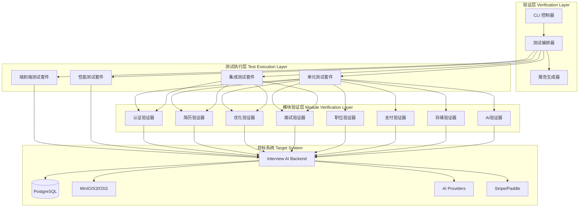
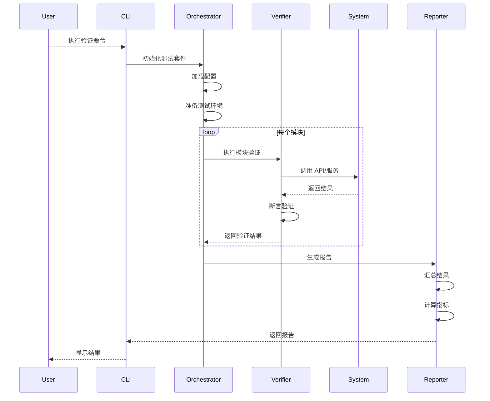

# 设计文档：核心功能完整性和可用性检查

## 概述

本设计文档定义了 Interview AI 核心功能验证系统的架构和实现方案。该系统旨在系统化地验证八大核心功能模块的完整性、可用性和上线就绪状态，包括：用户认证、简历管理、简历优化、面试模拟、职位管理、支付系统、文件存储和 AI 集成。

验证系统采用分层架构，结合自动化测试、手动验证清单、性能基准测试和端到端场景测试，确保每个模块在生产环境中稳定可靠运行。

### 设计目标

1. 提供全面的功能完整性验证框架
2. 自动化核心业务流程的端到端测试
3. 建立性能基准和监控指标
4. 生成详细的上线就绪评估报告
5. 支持持续集成和回归测试

### 设计原则

- 可扩展性：支持新模块和测试场景的快速添加
- 可维护性：测试代码清晰、模块化、易于理解
- 可观测性：详细的日志、指标和报告输出
- 隔离性：测试环境与生产环境隔离，使用测试数据
- 幂等性：测试可重复执行，不影响系统状态

## 架构

### 系统架构

验证系统采用三层架构：



### 验证流程



## 组件和接口

### 核心组件

#### 1. 测试编排器 (Test Orchestrator)

负责协调所有测试套件的执行，管理测试生命周期。

```typescript
interface TestOrchestrator {
  // 初始化测试环境
  initialize(config: TestConfig): Promise<void>;

  // 执行所有测试
  runAll(): Promise<TestResults>;

  // 执行特定模块测试
  runModule(moduleName: string): Promise<ModuleTestResult>;

  // 清理测试环境
  cleanup(): Promise<void>;
}

interface TestConfig {
  environment: 'test' | 'staging' | 'production';
  modules: string[];
  testTypes: TestType[];
  parallel: boolean;
  timeout: number;
  retries: number;
}

enum TestType {
  UNIT = 'unit',
  INTEGRATION = 'integration',
  E2E = 'e2e',
  PERFORMANCE = 'performance',
}
```

#### 2. 模块验证器 (Module Verifier)

每个核心模块对应一个验证器，实现特定的验证逻辑。

```typescript
interface ModuleVerifier {
  // 模块名称
  readonly moduleName: string;

  // 验证模块完整性
  verifyCompleteness(): Promise<CompletenessResult>;

  // 验证模块可用性
  verifyAvailability(): Promise<AvailabilityResult>;

  // 执行性能测试
  performanceTest(): Promise<PerformanceResult>;

  // 生成模块报告
  generateReport(): Promise<ModuleReport>;
}

interface CompletenessResult {
  passed: boolean;
  totalChecks: number;
  passedChecks: number;
  failedChecks: CheckResult[];
  warnings: string[];
}

interface AvailabilityResult {
  available: boolean;
  responseTime: number;
  errors: Error[];
  healthStatus: HealthStatus;
}

interface PerformanceResult {
  averageLatency: number;
  p95Latency: number;
  p99Latency: number;
  throughput: number;
  errorRate: number;
}
```

#### 3. 报告生成器 (Report Generator)

汇总所有测试结果，生成多格式报告。

```typescript
interface ReportGenerator {
  // 生成 JSON 报告
  generateJSON(results: TestResults): Promise<string>;

  // 生成 HTML 报告
  generateHTML(results: TestResults): Promise<string>;

  // 生成 Markdown 报告
  generateMarkdown(results: TestResults): Promise<string>;

  // 生成上线就绪评估
  generateReadinessAssessment(results: TestResults): Promise<ReadinessReport>;
}

interface ReadinessReport {
  overallStatus: 'READY' | 'NOT_READY' | 'CONDITIONAL';
  score: number; // 0-100
  criticalIssues: Issue[];
  warnings: Issue[];
  recommendations: string[];
  moduleStatuses: Map<string, ModuleStatus>;
}

interface ModuleStatus {
  name: string;
  status: 'PASS' | 'FAIL' | 'WARNING';
  completeness: number; // 0-100
  availability: number; // 0-100
  performance: number; // 0-100
  issues: Issue[];
}
```

### API 接口

#### 验证 API

```typescript
// POST /api/v1/verification/run
interface RunVerificationRequest {
  modules?: string[]; // 空则验证所有模块
  testTypes?: TestType[];
  config?: Partial<TestConfig>;
}

interface RunVerificationResponse {
  verificationId: string;
  status: 'RUNNING' | 'COMPLETED' | 'FAILED';
  startTime: Date;
  estimatedDuration: number;
}

// GET /api/v1/verification/:id/status
interface VerificationStatusResponse {
  verificationId: string;
  status: 'RUNNING' | 'COMPLETED' | 'FAILED';
  progress: number; // 0-100
  currentModule: string;
  results?: TestResults;
}

// GET /api/v1/verification/:id/report
interface VerificationReportResponse {
  verificationId: string;
  format: 'json' | 'html' | 'markdown';
  content: string;
  generatedAt: Date;
}
```

## 数据模型

### 验证记录

```typescript
interface VerificationRecord {
  id: string;
  startTime: Date;
  endTime?: Date;
  duration?: number;
  status: VerificationStatus;
  config: TestConfig;
  results: TestResults;
  report: ReadinessReport;
  createdBy: string;
  environment: string;
}

enum VerificationStatus {
  PENDING = 'PENDING',
  RUNNING = 'RUNNING',
  COMPLETED = 'COMPLETED',
  FAILED = 'FAILED',
  CANCELLED = 'CANCELLED',
}

interface TestResults {
  totalTests: number;
  passedTests: number;
  failedTests: number;
  skippedTests: number;
  duration: number;
  moduleResults: Map<string, ModuleTestResult>;
  performanceMetrics: PerformanceMetrics;
}

interface ModuleTestResult {
  moduleName: string;
  status: 'PASS' | 'FAIL' | 'SKIP';
  completeness: CompletenessResult;
  availability: AvailabilityResult;
  performance: PerformanceResult;
  testCases: TestCaseResult[];
}

interface TestCaseResult {
  name: string;
  status: 'PASS' | 'FAIL' | 'SKIP';
  duration: number;
  error?: Error;
  logs: string[];
}
```

### 性能指标

```typescript
interface PerformanceMetrics {
  responseTime: {
    average: number;
    median: number;
    p95: number;
    p99: number;
    min: number;
    max: number;
  };
  throughput: {
    requestsPerSecond: number;
    concurrentUsers: number;
  };
  errorRate: {
    total: number;
    rate: number; // 0-1
    byType: Map<string, number>;
  };
  resourceUsage: {
    cpu: number; // percentage
    memory: number; // MB
    disk: number; // MB
    network: number; // MB/s
  };
}
```

## 错误处理

### 错误分类

```typescript
enum VerificationErrorType {
  // 配置错误
  CONFIG_ERROR = 'CONFIG_ERROR',

  // 环境错误
  ENVIRONMENT_ERROR = 'ENVIRONMENT_ERROR',

  // 连接错误
  CONNECTION_ERROR = 'CONNECTION_ERROR',

  // 超时错误
  TIMEOUT_ERROR = 'TIMEOUT_ERROR',

  // 断言失败
  ASSERTION_ERROR = 'ASSERTION_ERROR',

  // 系统错误
  SYSTEM_ERROR = 'SYSTEM_ERROR',
}

class VerificationError extends Error {
  constructor(
    public type: VerificationErrorType,
    public message: string,
    public module: string,
    public testCase: string,
    public details?: any
  ) {
    super(message);
  }
}
```

### 错误处理策略

1. **重试机制**：对于网络错误和超时错误，自动重试最多 3 次
2. **降级策略**：如果某个模块验证失败，继续执行其他模块
3. **错误聚合**：收集所有错误，在报告中统一展示
4. **日志记录**：所有错误详细记录到日志文件
5. **告警通知**：关键错误触发告警通知

### 错误恢复

```typescript
interface ErrorRecoveryStrategy {
  // 判断是否可重试
  canRetry(error: VerificationError): boolean;

  // 执行重试
  retry(testCase: TestCase, attempt: number): Promise<TestCaseResult>;

  // 降级处理
  fallback(error: VerificationError): Promise<void>;

  // 清理资源
  cleanup(error: VerificationError): Promise<void>;
}
```

## 测试策略

### 测试层次

本验证系统采用多层次测试策略，确保全面覆盖：

#### 1. 单元测试 (Unit Tests)

验证各个模块的独立功能点，使用 mock 隔离外部依赖。

- 测试框架：Jest
- 覆盖率目标：> 80%
- 执行频率：每次代码提交

示例测试场景：

- 用户注册逻辑验证
- 简历解析函数验证
- JWT token 生成和验证
- 数据验证规则测试

#### 2. 集成测试 (Integration Tests)

验证模块间的交互和数据流，使用真实的数据库和服务。

- 测试框架：Jest + Supertest
- 数据库：测试数据库实例
- 执行频率：每次合并到主分支

示例测试场景：

- 用户注册 + 登录流程
- 简历上传 + 解析 + 存储流程
- 支付回调 + 订阅更新流程
- AI 调用 + 重试 + 降级流程

#### 3. 端到端测试 (E2E Tests)

模拟真实用户场景，验证完整业务流程。

- 测试框架：Jest + Supertest
- 环境：Staging 环境
- 执行频率：每日自动执行

示例测试场景：

- 完整求职流程：注册 → 上传简历 → 优化简历 → 面试模拟 → 导出 PDF
- 订阅升级流程：免费用户 → 支付 → Pro 用户 → 配额增加
- 多用户并发场景：100 个用户同时访问系统

#### 4. 性能测试 (Performance Tests)

验证系统在负载下的性能表现。

- 测试工具：Artillery / k6
- 指标：响应时间、吞吐量、错误率
- 执行频率：每周执行

示例测试场景：

- 登录接口：1000 req/s，响应时间 < 200ms
- 简历上传：100 并发，成功率 > 99%
- AI 调用：50 并发，P95 < 3s
- WebSocket 连接：500 并发连接

### 测试数据管理

```typescript
interface TestDataManager {
  // 创建测试数据
  createTestData(scenario: string): Promise<TestData>;

  // 清理测试数据
  cleanupTestData(testId: string): Promise<void>;

  // 重置数据库
  resetDatabase(): Promise<void>;

  // 加载 fixture
  loadFixture(name: string): Promise<any>;
}

interface TestData {
  users: User[];
  resumes: Resume[];
  jobs: Job[];
  subscriptions: Subscription[];
}
```

### 测试环境隔离

```typescript
interface TestEnvironment {
  // 初始化测试环境
  setup(): Promise<void>;

  // 清理测试环境
  teardown(): Promise<void>;

  // 获取测试配置
  getConfig(): TestConfig;

  // 获取测试数据库连接
  getDatabaseConnection(): DatabaseConnection;
}
```

### 模块验证详细策略

#### 1. 用户认证模块验证

```typescript
class AuthVerifier implements ModuleVerifier {
  async verifyCompleteness(): Promise<CompletenessResult> {
    const checks = [
      this.verifyEmailRegistration(),
      this.verifyEmailLogin(),
      this.verifyGoogleOAuth(),
      this.verifyGitHubOAuth(),
      this.verifyPasswordReset(),
      this.verifyJWTExpiration(),
      this.verifyEmailVerification(),
    ];

    return this.aggregateResults(checks);
  }

  private async verifyEmailRegistration(): Promise<CheckResult> {
    // 1. 创建测试用户
    // 2. 验证密码已哈希
    // 3. 验证用户记录已创建
    // 4. 验证返回 JWT token
  }

  private async verifyGoogleOAuth(): Promise<CheckResult> {
    // 1. 模拟 OAuth 回调
    // 2. 验证用户创建/更新
    // 3. 验证 account 记录
    // 4. 验证 session 创建
  }
}
```

#### 2. 简历管理模块验证

```typescript
class ResumeVerifier implements ModuleVerifier {
  async verifyCompleteness(): Promise<CompletenessResult> {
    const checks = [
      this.verifyPDFUpload(),
      this.verifyDOCXUpload(),
      this.verifyResumeParsing(),
      this.verifyVersionManagement(),
      this.verifyPrimaryResume(),
      this.verifyDuplicateDetection(),
      this.verifyResumeDeletion(),
    ];

    return this.aggregateResults(checks);
  }

  private async verifyPDFUpload(): Promise<CheckResult> {
    // 1. 上传测试 PDF 文件
    // 2. 验证文件存储成功
    // 3. 验证文本提取成功
    // 4. 验证 MD5 计算正确
  }

  private async verifyResumeParsing(): Promise<CheckResult> {
    // 1. 上传包含完整信息的简历
    // 2. 验证提取姓名、邮箱、电话
    // 3. 验证提取工作经验
    // 4. 验证提取教育背景
    // 5. 验证提取技能列表
  }
}
```

#### 3. 简历优化模块验证

```typescript
class OptimizationVerifier implements ModuleVerifier {
  async verifyCompleteness(): Promise<CompletenessResult> {
    const checks = [
      this.verifyMatchScoreCalculation(),
      this.verifySkillMatching(),
      this.verifyAISuggestions(),
      this.verifyOptimizedContent(),
      this.verifyPDFGeneration(),
      this.verifyStatusTransitions(),
      this.verifyErrorHandling(),
    ];

    return this.aggregateResults(checks);
  }

  private async verifyMatchScoreCalculation(): Promise<CheckResult> {
    // 1. 创建简历和职位
    // 2. 请求优化
    // 3. 验证匹配分数在 0-100 之间
    // 4. 验证分数计算逻辑合理
  }

  private async verifyAISuggestions(): Promise<CheckResult> {
    // 1. 请求优化建议
    // 2. 验证 AI 返回建议
    // 3. 验证建议格式正确
    // 4. 验证建议内容相关
  }
}
```

#### 4. 面试模拟模块验证

```typescript
class InterviewVerifier implements ModuleVerifier {
  async verifyCompleteness(): Promise<CompletenessResult> {
    const checks = [
      this.verifySessionCreation(),
      this.verifyQuestionGeneration(),
      this.verifyWebSocketConnection(),
      this.verifyMessagePersistence(),
      this.verifyAnswerEvaluation(),
      this.verifySessionCompletion(),
      this.verifyPersonaStyles(),
      this.verifyInterviewReport(),
    ];

    return this.aggregateResults(checks);
  }

  private async verifyWebSocketConnection(): Promise<CheckResult> {
    // 1. 建立 WebSocket 连接
    // 2. 发送测试消息
    // 3. 验证双向通信
    // 4. 验证消息持久化
  }

  private async verifyQuestionGeneration(): Promise<CheckResult> {
    // 1. 创建面试会话
    // 2. 请求生成问题
    // 3. 验证问题相关性
    // 4. 验证问题多样性
  }
}
```

#### 5. 职位管理模块验证

```typescript
class JobVerifier implements ModuleVerifier {
  async verifyCompleteness(): Promise<CompletenessResult> {
    const checks = [
      this.verifyJobCreation(),
      this.verifyJobParsing(),
      this.verifyExternalIntegration(),
      this.verifyJobMatching(),
      this.verifyJobSearch(),
      this.verifyJobInactivation(),
      this.verifyApplicationTracking(),
    ];

    return this.aggregateResults(checks);
  }

  private async verifyJobMatching(): Promise<CheckResult> {
    // 1. 创建用户简历
    // 2. 创建职位
    // 3. 执行匹配
    // 4. 验证语义分数
    // 5. 验证技能分数
    // 6. 验证偏好分数
  }
}
```

#### 6. 支付系统模块验证

```typescript
class PaymentVerifier implements ModuleVerifier {
  async verifyCompleteness(): Promise<CompletenessResult> {
    const checks = [
      this.verifyStripeCheckout(),
      this.verifyPaddleCheckout(),
      this.verifyWebhookProcessing(),
      this.verifySubscriptionEvents(),
      this.verifyQuotaLimits(),
      this.verifyTierUpgrade(),
      this.verifySubscriptionCancellation(),
    ];

    return this.aggregateResults(checks);
  }

  private async verifyStripeCheckout(): Promise<CheckResult> {
    // 1. 创建 checkout session
    // 2. 验证返回 URL
    // 3. 模拟 webhook 回调
    // 4. 验证订阅更新
  }

  private async verifyQuotaLimits(): Promise<CheckResult> {
    // 1. 创建 FREE 用户
    // 2. 消耗配额
    // 3. 验证配额限制生效
    // 4. 升级到 PRO
    // 5. 验证配额增加
  }
}
```

#### 7. 文件存储模块验证

```typescript
class StorageVerifier implements ModuleVerifier {
  async verifyCompleteness(): Promise<CompletenessResult> {
    const checks = [
      this.verifyMinIOUpload(),
      this.verifyS3Upload(),
      this.verifyOSSUpload(),
      this.verifyFileMetadata(),
      this.verifyFileDownload(),
      this.verifyFileDeletion(),
      this.verifyPresignedURLs(),
      this.verifyChunkUpload(),
    ];

    return this.aggregateResults(checks);
  }

  private async verifyMinIOUpload(): Promise<CheckResult> {
    // 1. 上传测试文件到 MinIO
    // 2. 验证文件存在
    // 3. 验证 URL 可访问
    // 4. 验证 MD5 正确
  }

  private async verifyChunkUpload(): Promise<CheckResult> {
    // 1. 创建大文件上传会话
    // 2. 分块上传
    // 3. 完成上传
    // 4. 验证文件完整性
  }
}
```

#### 8. AI 集成模块验证

```typescript
class AIVerifier implements ModuleVerifier {
  async verifyCompleteness(): Promise<CompletenessResult> {
    const checks = [
      this.verifyOpenAIProvider(),
      this.verifyDeepSeekProvider(),
      this.verifyQwenProvider(),
      this.verifyFallbackMechanism(),
      this.verifyCallLogging(),
      this.verifyRetryLogic(),
      this.verifyCircuitBreaker(),
      this.verifyUsageTracking(),
    ];

    return this.aggregateResults(checks);
  }

  private async verifyFallbackMechanism(): Promise<CheckResult> {
    // 1. 模拟主提供商失败
    // 2. 验证自动切换到备用提供商
    // 3. 验证请求成功
    // 4. 验证降级日志记录
  }

  private async verifyCircuitBreaker(): Promise<CheckResult> {
    // 1. 模拟连续失败
    // 2. 验证熔断器打开
    // 3. 验证后续请求被拒绝
    // 4. 等待恢复时间
    // 5. 验证熔断器关闭
  }
}
```

### 性能基准

```typescript
interface PerformanceBenchmark {
  module: string;
  operation: string;
  target: {
    averageLatency: number; // ms
    p95Latency: number; // ms
    throughput: number; // req/s
    errorRate: number; // percentage
  };
  actual: {
    averageLatency: number;
    p95Latency: number;
    throughput: number;
    errorRate: number;
  };
  passed: boolean;
}

const PERFORMANCE_BENCHMARKS: PerformanceBenchmark[] = [
  {
    module: 'auth',
    operation: 'login',
    target: {
      averageLatency: 200,
      p95Latency: 500,
      throughput: 100,
      errorRate: 0.1,
    },
  },
  {
    module: 'resume',
    operation: 'upload',
    target: {
      averageLatency: 2000,
      p95Latency: 5000,
      throughput: 50,
      errorRate: 0.5,
    },
  },
  {
    module: 'optimization',
    operation: 'analyze',
    target: {
      averageLatency: 5000,
      p95Latency: 10000,
      throughput: 20,
      errorRate: 1.0,
    },
  },
  {
    module: 'interview',
    operation: 'session',
    target: {
      averageLatency: 1000,
      p95Latency: 3000,
      throughput: 30,
      errorRate: 0.5,
    },
  },
];
```

## 实现计划

### 阶段 1：基础设施搭建（第 1-2 周）

1. 创建测试项目结构
2. 配置测试框架和工具
3. 实现测试编排器
4. 实现报告生成器
5. 配置 CI/CD 集成

### 阶段 2：模块验证器实现（第 3-6 周）

1. 实现用户认证验证器
2. 实现简历管理验证器
3. 实现简历优化验证器
4. 实现面试模拟验证器
5. 实现职位管理验证器
6. 实现支付系统验证器
7. 实现文件存储验证器
8. 实现 AI 集成验证器

### 阶段 3：测试用例编写（第 7-10 周）

1. 编写单元测试用例
2. 编写集成测试用例
3. 编写端到端测试用例
4. 编写性能测试用例
5. 编写手动验证清单

### 阶段 4：性能优化和报告（第 11-12 周）

1. 执行性能测试
2. 优化慢速测试
3. 完善报告格式
4. 生成上线就绪评估
5. 文档编写

### 交付物

1. 完整的测试套件代码
2. 测试执行脚本和 CLI 工具
3. CI/CD 配置文件
4. 测试报告模板
5. 手动验证清单
6. 上线就绪评估报告
7. 技术文档和使用指南
