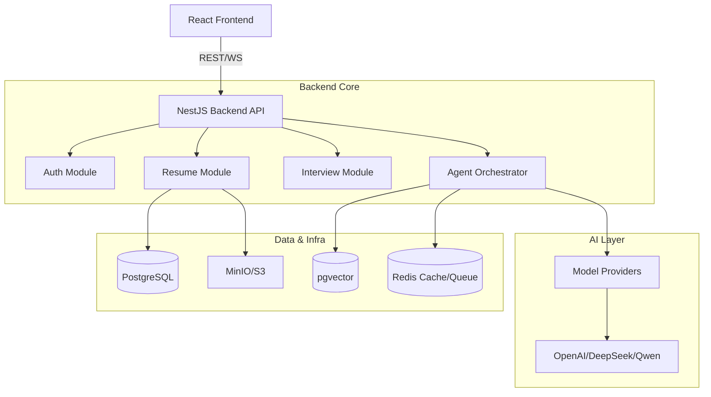

# Code Review & Optimization Plan

Based on a comprehensive review of the `ai-resume` codebase, I have prepared the following report and plan.

## 1. Code Review & Analysis

### System Architecture

The system follows a robust **Layered Monolithic Architecture** with clear separation of concerns.

**Conceptual Architecture:**

### Key Modules & Business Logic

* **Backend (`packages/backend`)**:

  * **Core**: `AgentModule` (LangChain orchestration), `ResumeModule` (Parsing/Optimization), `InterviewModule`.

  * **Infra**: `PrismaModule` (ORM), `RedisModule` (BullMQ/Caching), `StorageModule`.

  * **Business**: `AuthModule` (JWT/OAuth), `PaymentModule` (Stripe/Paddle), `QuotaModule`.

* **Frontend (`packages/frontend`)**:

  * **State**: Zustand (`useConversationStore`, `useResumeStore`).

  * **Key Pages**: `ChatPage` (Core interaction), `ResumeBuilder`, `Dashboard`.

  * **Real-time**: `useChatSocket` for WebSocket communication.

## 2. Functionality Integrity Check

| Feature Module          | Status        | Verification Notes                                              |
| :---------------------- | :------------ | :-------------------------------------------------------------- |
| **Resume Parsing**      | ✅ Implemented | Uses `resume-parser.tool.ts`. Supports PDF/DOCX.                |
| **Resume Optimization** | ✅ Implemented | STAR method transformation, JD gap analysis.                    |
| **Mock Interview**      | ✅ Implemented | Voice/Text interaction, feedback generation.                    |
| **Resume Builder**      | ⚠️ Partial    | Editor exists but cloud sync/persistence is flagged in Roadmap. |
| **Authentication**      | ✅ Implemented | Google/GitHub OAuth + JWT Strategies.                           |
| **Payments**            | ✅ Implemented | Stripe & Paddle providers integrated.                           |
| **Monitoring**          | ✅ Implemented | Sentry, Prometheus metrics, and custom logging.                 |

**Identified Gaps:**

1. **Resume Builder Persistence**: Currently lacks robust cloud synchronization for the editor state.
2. **User Feedback Loop**: Mechanism for users to rate AI response quality is basic.
3. **Admin Dashboard**: Basic model config exists, but full user management UI is limited.

## 3. Performance & Quality Assessment

### Quality Metrics

* **Type Safety**: High. TypeScript is used consistently across the stack.

* **Modularity**: Excellent. NestJS modules effectively encapsulate logic.

* **Error Handling**: Global Exception Filter and Sentry integration are in place.

* **Testing**:

  * Backend: Unit tests exist for services, but E2E coverage is limited.

  * Frontend: Component tests are present but sparse.

### Technical Debt & Risks

* **`ChatPage.tsx`** **Complexity**: The file is becoming a "God Component" (>370 lines) mixing UI, socket logic, and state management.

* **Agent Orchestration**: The `AgentModule` is complex; adding new agent capabilities requires touching multiple files.

* **Database Performance**: Potential N+1 query issues in `Prisma` usage within loops (needs verification).

* **Bundle Size**: Frontend imports heavy libraries (AntD, potential chart libs) without aggressive code splitting strategies visible.

## 4. Optimization Proposals

### P0: Critical & High Impact

1. **Refactor** **`ChatPage`**: Split into smaller, presentational components (`ChatStream`, `UploadManager`, `OptimizationPanel`) and move logic to custom hooks.
2. **Fix Resume Builder Persistence**: Implement auto-save to backend for the Resume Builder.
3. **Optimize Docker Build**: Ensure multi-stage builds are fully optimized for production size.

### P1: Performance & Scalability

1. **Redis Caching Strategy**: Implement `@CacheKey` decorators for frequently accessed static data (e.g., Job Descriptions, Templates).
2. **Database Indexing**: Review Prisma schema for missing indexes on frequently queried fields (`userId`, `status`).

### P2: Developer Experience

1. **E2E Testing Pipeline**: Set up Cypress or Playwright for critical user flows (Login -> Upload -> Optimize).
2. **Storybook**: Introduce Storybook for frontend component isolation.

## 5. Functionality Roadmap (3-6 Months)

### Month 1: Stabilization & Refactoring

* [ ] Refactor `ChatPage` to reduce complexity.

* [ ] Implement cloud persistence for Resume Builder.

* [ ] Increase Backend Unit Test coverage to 70%.

### Month 2: Enhanced User Experience

* [ ] **Real-time Collaboration**: Allow users to share resume drafts.

* [ ] **Voice Mode 2.0**: Improve latency for Mock Interview TTS/STT.

* [ ] **Multi-language UI**: Full i18n support (Frontend + Prompt Templates).

### Month 3: Enterprise Features

* [ ] **Team Accounts**: Shared credits and candidate pools.

* [ ] **Analytics Dashboard**: Advanced visualization of interview performance over time.

* [ ] **Plugin System**: Allow third-party integrations (e.g., LinkedIn import).

### Month 4-6: Advanced AI Capabilities

* [ ] **Agentic Workflows**: Autonomous job application agent.

* [ ] **Video Analysis**: Analyze facial expressions during mock interviews (experimental).

