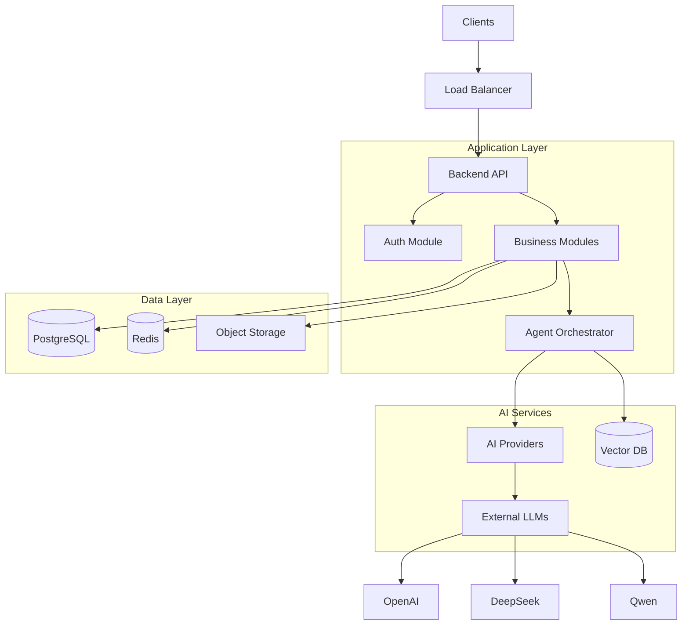
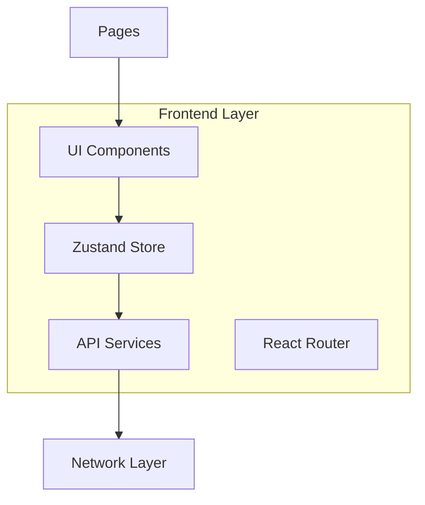
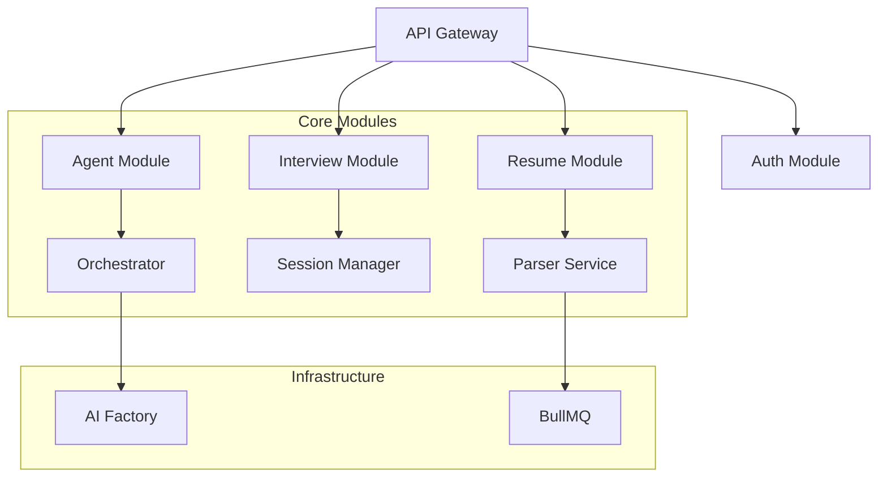
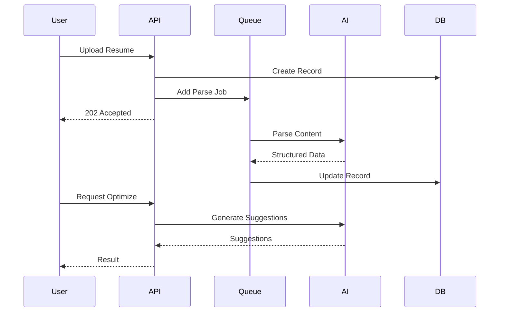
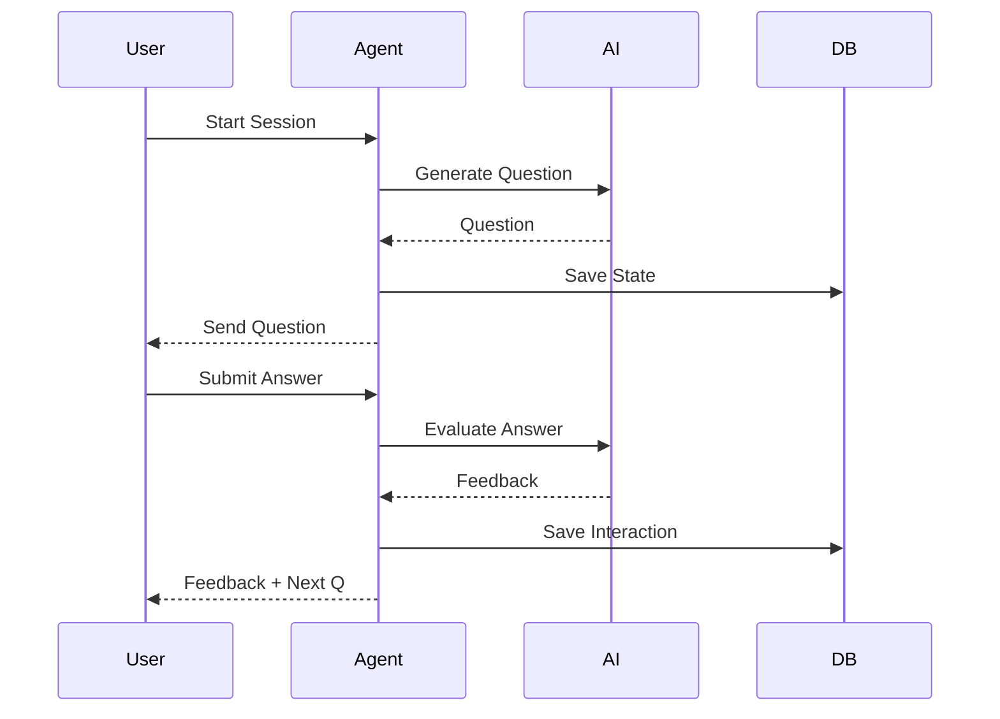
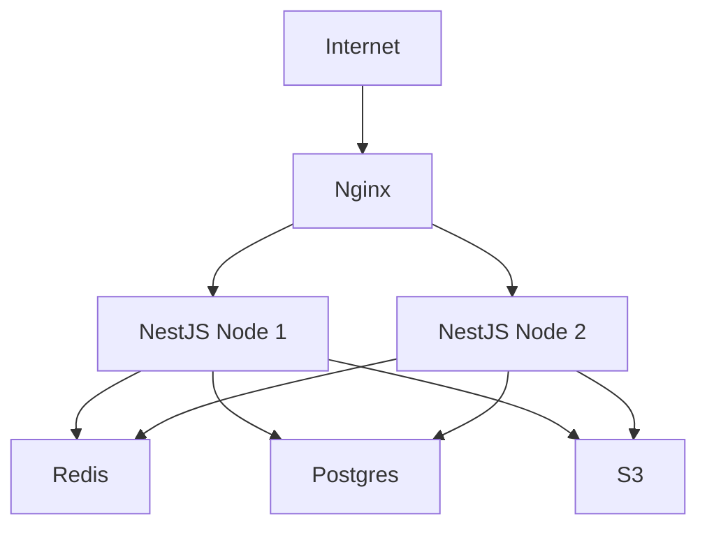

# IntervAI - System Architecture

## Overview

This document provides a comprehensive view of the system architecture, including frontend, backend, databases, caching, and AI integration layers.

## High-Level Architecture

The system follows a layered architecture pattern, separating concerns between client presentation, business logic, data storage, and external AI services.

## Component Details

### 1. Frontend Architecture

The frontend is built with React 18, utilizing a feature-based folder structure.

### 2. Backend Module Architecture

The backend uses NestJS modules to encapsulate business logic.

### 3. Data Flow - Resume Upload & Optimization

### 4. Data Flow - Mock Interview

## Technology Stack

### Frontend
- **Framework**: React 18 + TypeScript
- **Build**: Vite
- **State**: Zustand
- **UI**: Tailwind CSS + Ant Design

### Backend
- **Framework**: NestJS
- **Language**: TypeScript
- **Queue**: BullMQ (Redis)
- **Validation**: Zod / Class-validator

### Infrastructure
- **Database**: PostgreSQL (Primary Data)
- **Vector DB**: pgvector (Embeddings)
- **Cache**: Redis
- **Storage**: MinIO / S3

## Security Architecture

1. **Authentication**: JWT-based stateless auth.
2. **Authorization**: RBAC (Role-Based Access Control).
3. **Data Protection**: Encrypted secrets, sanitized inputs.
4. **Network**: HTTPS everywhere, CORS whitelisting.

## Deployment Architecture

