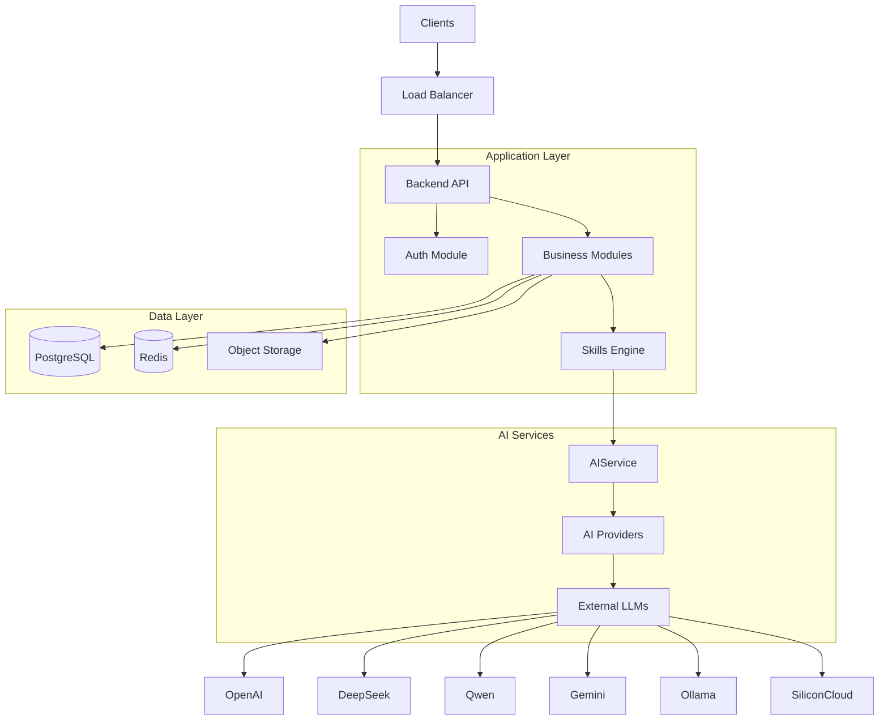
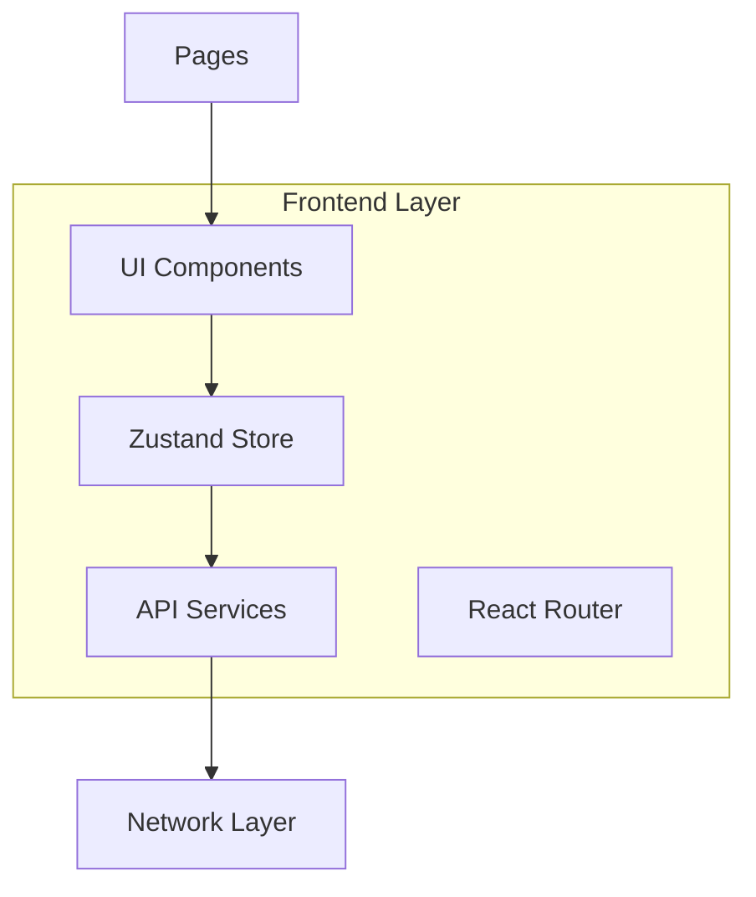
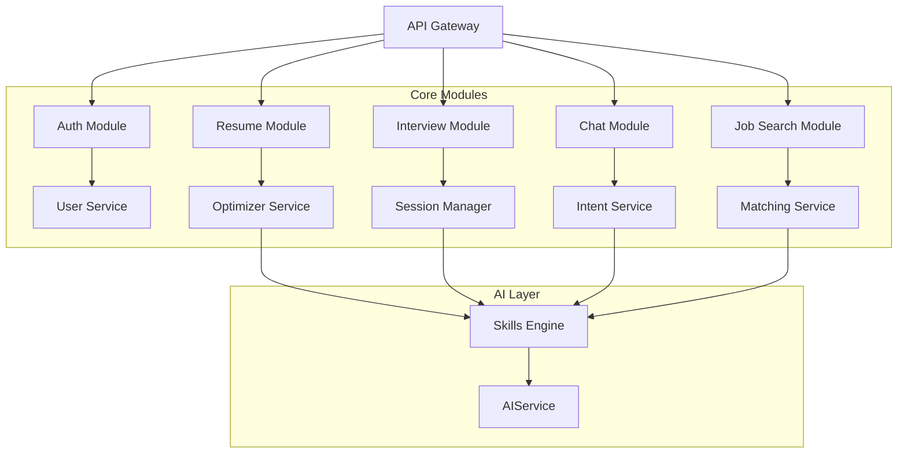
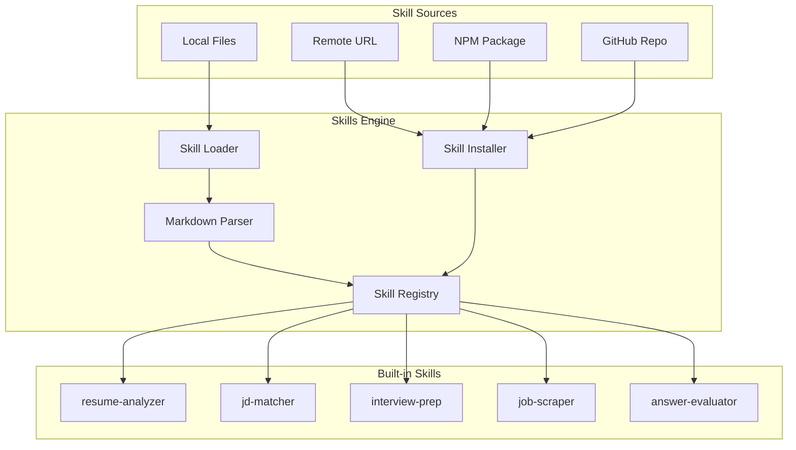
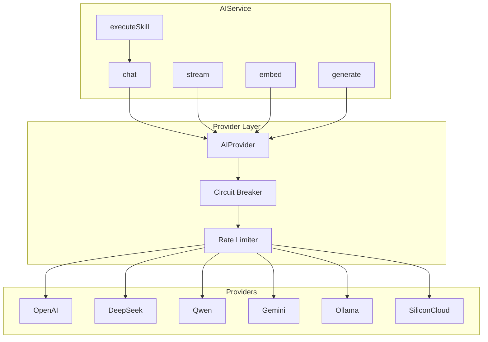
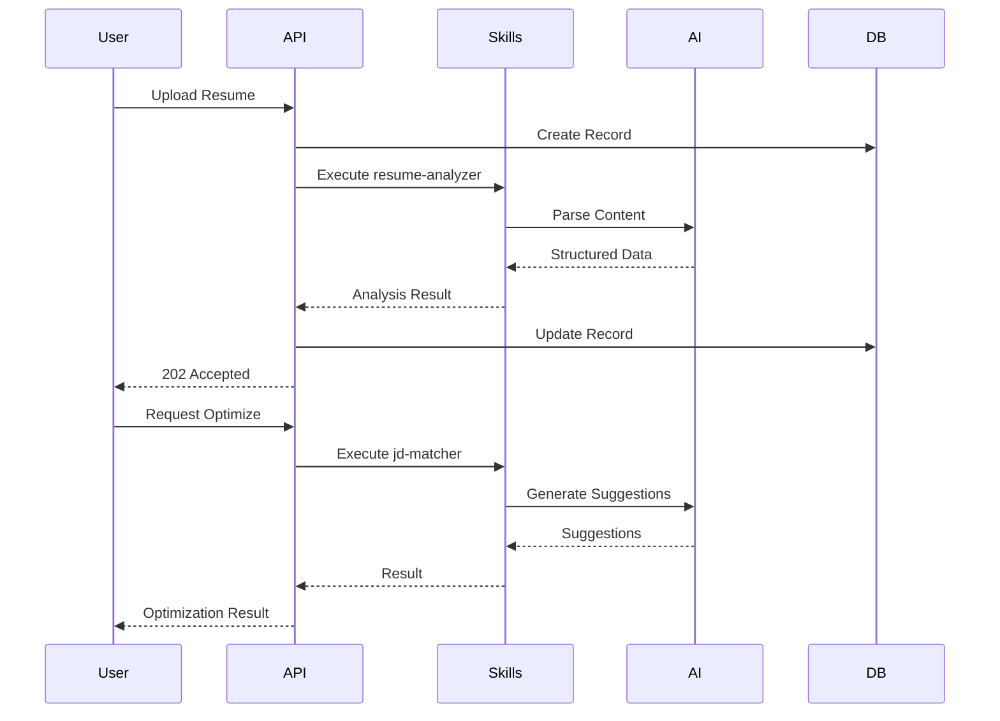
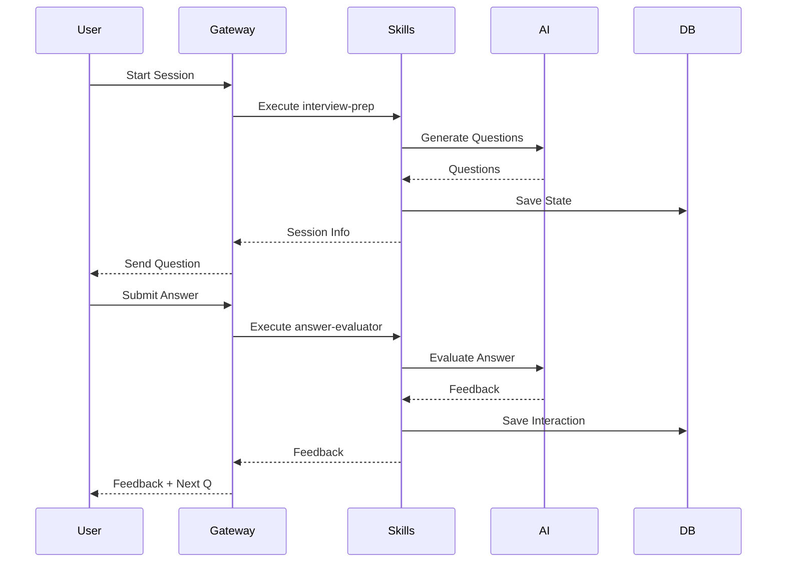
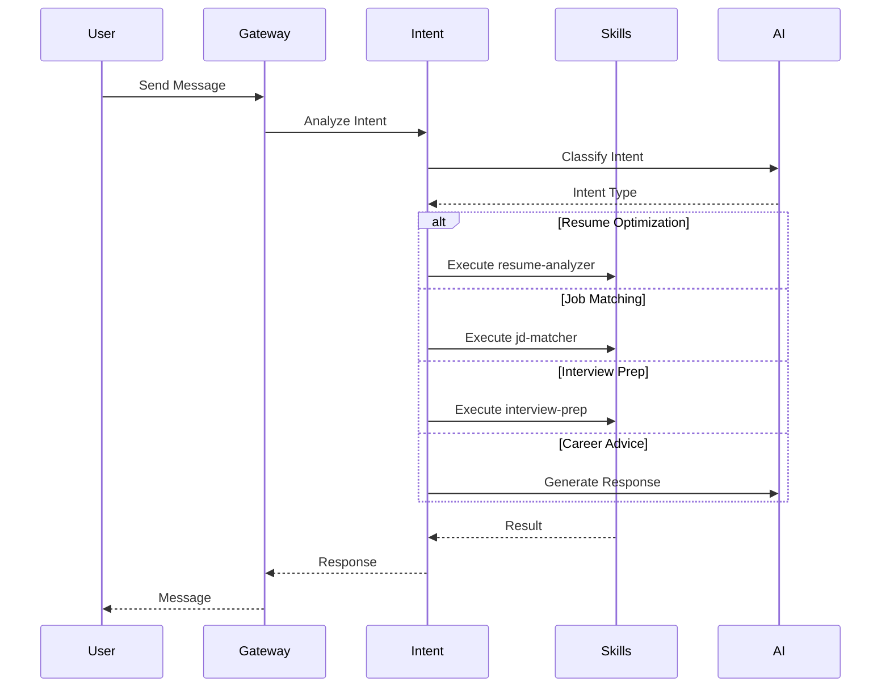
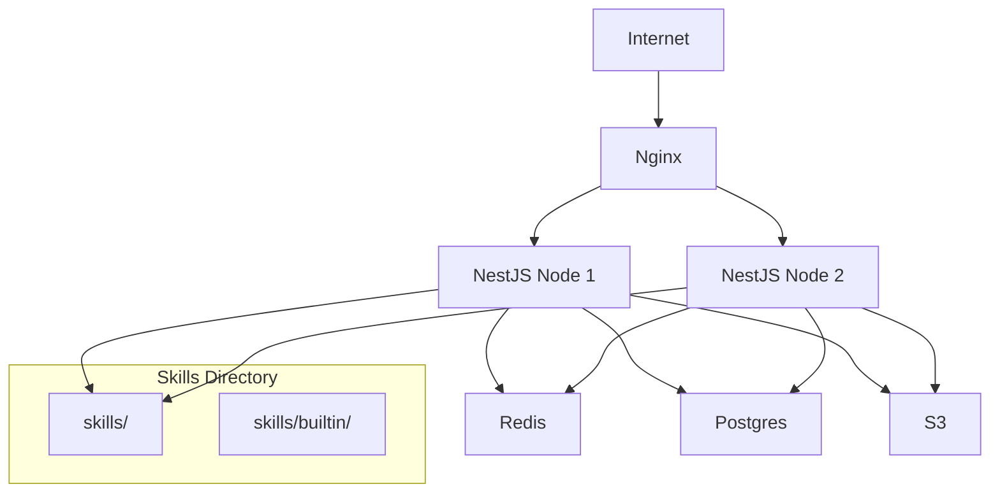

# IntervAI - System Architecture

## Overview

This document provides a comprehensive view of the system architecture, including frontend, backend, databases, caching, and AI integration layers.

## High-Level Architecture

The system follows a layered architecture pattern, separating concerns between client presentation, business logic, data storage, and external AI services.


```mermaid
graph TB
    Client[Clients] --> LB[Load Balancer]
    LB --> API[Backend API]
    
    subgraph "Application Layer"
        API --> Auth[Auth Module]
        API --> Biz[Business Modules]
        Biz --> Skills[Skills Engine]
    end

    subgraph "Data Layer"
        Biz --> DB[(PostgreSQL)]
        Biz --> Cache[(Redis)]
        Biz --> Storage[Object Storage]
    end

    subgraph "AI Services"
        Skills --> AI[AIService]
        AI --> Providers[AI Providers]
        Providers --> LLMs[External LLMs]
    end

    LLMs --> OpenAI
    LLMs --> DeepSeek
    LLMs --> Qwen
    LLMs --> Gemini
    LLMs --> Ollama
    LLMs --> SiliconCloud
```

## Component Details

### 1. Frontend Architecture

The frontend is built with React 18, utilizing a feature-based folder structure.


```mermaid
graph TD
    subgraph "Frontend Layer"
        UI[UI Components]
        Store[Zustand Store]
        Service[API Services]
        Router[React Router]
    end

    Page[Pages] --> UI
    UI --> Store
    Store --> Service
    Service --> Network[Network Layer]
```

### 2. Backend Module Architecture

The backend uses NestJS modules to encapsulate business logic.


```mermaid
graph TB
    Gateway[API Gateway] --> AuthMod[Auth Module]
    Gateway --> ResumeMod[Resume Module]
    Gateway --> InterviewMod[Interview Module]
    Gateway --> ChatMod[Chat Module]
    Gateway --> JobSearchMod[Job Search Module]

    subgraph "Core Modules"
        AuthMod --> User[User Service]
        ResumeMod --> Optimizer[Optimizer Service]
        InterviewMod --> Session[Session Manager]
        ChatMod --> Intent[Intent Service]
        JobSearchMod --> Matching[Matching Service]
    end

    subgraph "AI Layer"
        Optimizer --> Skills[Skills Engine]
        Session --> Skills
        Intent --> Skills
        Matching --> Skills
        Skills --> AI[AIService]
    end
```

### 3. Skills Engine Architecture

The Skills Engine is a pluggable system for extending AI capabilities.


```mermaid
graph TB
    subgraph "Skills Engine"
        Registry[Skill Registry]
        Loader[Skill Loader]
        Parser[Markdown Parser]
        Installer[Skill Installer]
    end

    subgraph "Skill Sources"
        Local[Local Files]
        Remote[Remote URL]
        NPM[NPM Package]
        GitHub[GitHub Repo]
    end

    subgraph "Built-in Skills"
        ResumeAnalyzer[resume-analyzer]
        JDMatcher[jd-matcher]
        InterviewPrep[interview-prep]
        JobScraper[job-scraper]
        AnswerEvaluator[answer-evaluator]
    end

    Local --> Loader
    Remote --> Installer
    NPM --> Installer
    GitHub --> Installer
    
    Loader --> Parser
    Parser --> Registry
    Installer --> Registry
    
    Registry --> ResumeAnalyzer
    Registry --> JDMatcher
    Registry --> InterviewPrep
    Registry --> JobScraper
    Registry --> AnswerEvaluator
```

### 4. AI Service Architecture


```mermaid
graph TB
    subgraph "AIService"
        Chat[chat]
        Stream[stream]
        Embed[embed]
        Generate[generate]
        ExecuteSkill[executeSkill]
    end

    subgraph "Provider Layer"
        Provider[AIProvider]
        CircuitBreaker[Circuit Breaker]
        RateLimiter[Rate Limiter]
    end

    subgraph "Providers"
        OpenAI[OpenAI]
        DeepSeek[DeepSeek]
        Qwen[Qwen]
        Gemini[Gemini]
        Ollama[Ollama]
        SiliconCloud[SiliconCloud]
    end

    Chat --> Provider
    Stream --> Provider
    Embed --> Provider
    Generate --> Provider
    ExecuteSkill --> Chat

    Provider --> CircuitBreaker
    CircuitBreaker --> RateLimiter
    RateLimiter --> OpenAI
    RateLimiter --> DeepSeek
    RateLimiter --> Qwen
    RateLimiter --> Gemini
    RateLimiter --> Ollama
    RateLimiter --> SiliconCloud
```

### 5. Data Flow - Resume Upload & Optimization


```mermaid
sequenceDiagram
    participant User
    participant API
    participant Skills
    participant AI
    participant DB

    User->>API: Upload Resume
    API->>DB: Create Record
    API->>Skills: Execute resume-analyzer
    Skills->>AI: Parse Content
    AI-->>Skills: Structured Data
    Skills-->>API: Analysis Result
    API->>DB: Update Record
    API-->>User: 202 Accepted
    
    User->>API: Request Optimize
    API->>Skills: Execute jd-matcher
    Skills->>AI: Generate Suggestions
    AI-->>Skills: Suggestions
    Skills-->>API: Result
    API-->>User: Optimization Result
```

### 6. Data Flow - Mock Interview


```mermaid
sequenceDiagram
    participant User
    participant Gateway
    participant Skills
    participant AI
    participant DB

    User->>Gateway: Start Session
    Gateway->>Skills: Execute interview-prep
    Skills->>AI: Generate Questions
    AI-->>Skills: Questions
    Skills->>DB: Save State
    Skills-->>Gateway: Session Info
    Gateway-->>User: Send Question

    User->>Gateway: Submit Answer
    Gateway->>Skills: Execute answer-evaluator
    Skills->>AI: Evaluate Answer
    AI-->>Skills: Feedback
    Skills->>DB: Save Interaction
    Skills-->>Gateway: Feedback
    Gateway-->>User: Feedback + Next Q
```

### 7. Data Flow - Chat Intent


```mermaid
sequenceDiagram
    participant User
    participant Gateway
    participant Intent
    participant Skills
    participant AI

    User->>Gateway: Send Message
    Gateway->>Intent: Analyze Intent
    Intent->>AI: Classify Intent
    AI-->>Intent: Intent Type
    
    alt Resume Optimization
        Intent->>Skills: Execute resume-analyzer
    else Job Matching
        Intent->>Skills: Execute jd-matcher
    else Interview Prep
        Intent->>Skills: Execute interview-prep
    else Career Advice
        Intent->>AI: Generate Response
    end
    
    Skills-->>Intent: Result
    Intent-->>Gateway: Response
    Gateway-->>User: Message
```

## Technology Stack

### Frontend
| Component | Technology |
|-----------|------------|
| Framework | React 18 + TypeScript |
| Build | Vite |
| State | Zustand |
| UI | Tailwind CSS + Ant Design |
| i18n | react-i18next |

### Backend
| Component | Technology |
|-----------|------------|
| Framework | NestJS |
| Language | TypeScript |
| ORM | Prisma |
| Queue | BullMQ (Redis) |
| Validation | Zod / Class-validator |
| WebSocket | Socket.IO |

### Infrastructure
| Component | Technology |
|-----------|------------|
| Database | PostgreSQL |
| Vector DB | pgvector (Embeddings) |
| Cache | Redis |
| Storage | MinIO / S3 / Aliyun OSS |

### AI Providers
| Provider | Models |
|----------|--------|
| OpenAI | GPT-4o, GPT-4-turbo, GPT-3.5-turbo |
| DeepSeek | deepseek-chat, deepseek-coder |
| Qwen | qwen-turbo, qwen-plus, qwen-max |
| Gemini | gemini-pro, gemini-1.5-pro |
| Ollama | Local models |
| SiliconCloud | Various open-source models |

## Security Architecture

1. **Authentication**: JWT-based stateless auth with OAuth support (Google, GitHub)
2. **Authorization**: RBAC (Role-Based Access Control)
3. **Data Protection**: Encrypted secrets, sanitized inputs
4. **Network**: HTTPS everywhere, CORS whitelisting
5. **Rate Limiting**: Token bucket per provider
6. **Circuit Breaker**: Fault tolerance for AI providers

## Deployment Architecture


```mermaid
graph TB
    Internet --> Nginx
    Nginx --> App1[NestJS Node 1]
    Nginx --> App2[NestJS Node 2]
    
    App1 --> Redis
    App2 --> Redis
    
    App1 --> Postgres
    App2 --> Postgres
    
    App1 --> S3
    App2 --> S3

    subgraph "Skills Directory"
        Skills1[skills/]
        Skills2[skills/builtin/]
    end

    App1 --> Skills1
    App2 --> Skills1
```

## Directory Structure

### Backend (`packages/backend/src/`)

```
src/
├── common/                 # Shared utilities
│   ├── decorators/         # Custom decorators
│   ├── exceptions/         # Exception classes
│   ├── filters/            # Exception filters
│   ├── guards/             # Auth guards
│   ├── interceptors/       # Request/response interceptors
│   ├── middleware/         # Express middleware
│   ├── pipes/              # Validation pipes
│   └── utils/              # Utility functions
│
├── core/                   # Core business modules
│   ├── account/            # Account management
│   ├── ai/                 # AI service & skills engine
│   │   ├── providers/      # AI provider implementations
│   │   ├── skills/         # Skills engine (registry, loader, parser)
│   │   ├── utils/          # Circuit breaker, rate limiter, usage tracker
│   │   └── memory/         # Conversation memory
│   ├── auth/               # Authentication
│   ├── backup/             # Backup service
│   ├── chat/               # Chat gateway & intent
│   ├── conversation/       # Conversation management
│   ├── health/             # Health checks
│   ├── invitation/         # Invitation system
│   ├── payment/            # Payment processing
│   ├── quota/              # Usage quota
│   ├── storage/            # File storage
│   └── user/               # User management
│
├── features/               # Feature modules
│   ├── interview/          # Mock interview
│   ├── job/                # Job management
│   ├── job-search/         # Job search automation
│   ├── resume/             # Resume optimization
│   └── tasks/              # Background tasks
│
└── e2e/                    # End-to-end tests
```

### Skills Directory (`packages/backend/skills/`)

```
skills/
├── resume-analyzer.md      # Resume parsing skill
├── jd-matcher.md           # Job description matching
├── interview-prep.md       # Interview preparation
├── job-scraper.md          # Job scraping
├── answer-evaluator.md     # Answer evaluation
└── builtin/                # Built-in skills (optional)
```

## Skills Engine

### Skill Definition Format

Skills are defined in Markdown with YAML frontmatter:

```markdown
---
name: skill-name
version: 1.0.0
description: Skill description
author: Author Name
tags: [tag1, tag2]
inputs:
  inputName:
    type: string
    required: true
    description: Input description
outputs:
  type: object
---

# System Prompt

The skill's prompt template goes here...
```

### Skill Lifecycle

1. **Installation**: Load from local file, URL, NPM, or GitHub
2. **Registration**: Register with SkillRegistry
3. **Execution**: Called via `aiService.executeSkill(name, inputs, userId)`
4. **Uninstallation**: Remove from registry and delete files

### Built-in Skills

| Skill | Description | Use Case |
|-------|-------------|----------|
| resume-analyzer | Parse resume and extract info | Resume upload, skill analysis |
| jd-matcher | Match JD against resume | Job matching, optimization |
| interview-prep | Generate interview prep materials | Interview preparation |
| job-scraper | Extract job posting info | Job aggregation |
| answer-evaluator | Evaluate interview answers | Mock interview feedback |

## Configuration

### Environment Variables

| Variable | Description | Required |
|----------|-------------|----------|
| `DATABASE_URL` | PostgreSQL connection | Yes |
| `REDIS_HOST` | Redis host | Yes |
| `REDIS_PORT` | Redis port | Yes |
| `JWT_SECRET` | JWT signing secret | Yes |
| `OPENAI_API_KEY` | OpenAI API key | Optional |
| `DEEPSEEK_API_KEY` | DeepSeek API key | Optional |
| `QWEN_API_KEY` | Qwen API key | Optional |
| `GEMINI_API_KEY` | Gemini API key | Optional |
| `SKILLS_DIR` | Skills directory path | No (default: skills/) |

### Skills Configuration

```typescript
// Environment variables for skills
SKILLS_DIR=skills                    # User skills directory
BUILTIN_SKILLS_DIR=skills/builtin    # Built-in skills directory
ENABLE_REMOTE_SKILLS=true            # Enable remote skill installation
CACHE_SKILLS=true                    # Cache skills in memory
SKILLS_CACHE_DIR=.intervai/skills    # Cache directory for installed skills
```
