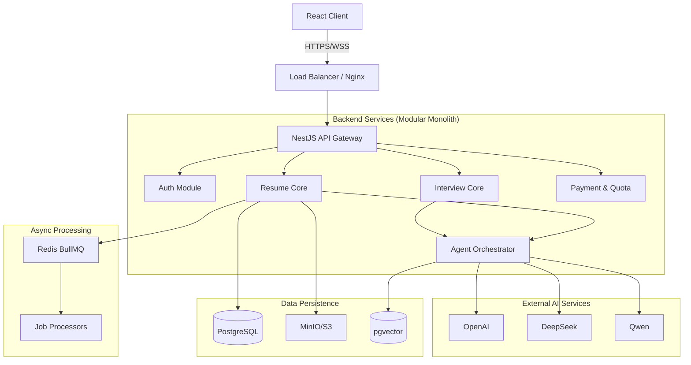

# Code Review & Architecture Report

**Date:** 2026-01-19
**Project:** AI Resume (IntervAI)

## 1. Executive Summary

The `ai-resume` project is a comprehensive platform designed to assist job seekers with resume optimization and interview preparation using advanced AI capabilities. The system utilizes a modern, monolithic architecture (Monorepo) facilitating code sharing and unified deployment. The backend is built on **NestJS** for robustness and scalability, while the frontend employs **React** with **Vite** for a responsive user experience.

## 2. System Architecture

### 2.1 High-Level Architecture

The system follows a standard layered architecture:

### 2.2 Key Technical Decisions

*   **Monorepo Strategy**: Using `pnpm` workspaces allows for tight integration between frontend and backend types, reducing contract drift.
*   **Database**: PostgreSQL is used as the primary relational store, with `pgvector` enabling semantic search capabilities without needing a separate vector database.
*   **Asynchronous Processing**: Heavy AI tasks (resume parsing, optimization) are offloaded to `BullMQ` (Redis), ensuring the API remains responsive.
*   **Agent Abstraction**: A custom `AgentModule` wraps LangChain, providing a unified interface for multiple LLM providers (OpenAI, DeepSeek, etc.).

## 3. Module Analysis

### 3.1 Backend (`packages/backend`)

| Module | Responsibility | Key Components |
| :--- | :--- | :--- |
| **AgentModule** | Orchestrates AI interactions. | `AgentOrchestrator`, `LangChainService`, `VectorStoreAdapter`. |
| **ResumeModule** | Handles resume lifecycle. | `ResumeParser` (PDF/Docx), `OptimizationService` (STAR method). |
| **InterviewModule** | Manages mock interviews. | `SessionManager`, `FeedbackGenerator`. |
| **AuthModule** | Security & Identity. | `JwtStrategy`, `GoogleStrategy`, `GitHubStrategy`. |
| **ChatModule** | Real-time communication. | `ChatGateway` (WebSocket), `ChatService`. |

### 3.2 Frontend (`packages/frontend`)

| Component | Responsibility | Key Libraries |
| :--- | :--- | :--- |
| **ChatPage** | Core interaction loop. | `useChatSocket`, `useChatItems`. |
| **ResumeBuilder** | Visual resume editor. | Custom components, local state. |
| **Dashboard** | User analytics & history. | Ant Design Charts. |
| **State Mgmt** | Global application state. | `Zustand`. |

## 4. Data Flow Analysis

### 4.1 Resume Optimization Flow
1.  **Upload**: User uploads file -> API streams to S3/MinIO.
2.  **Parse**: `ResumeParser` job added to Queue -> Worker extracts text & structure.
3.  **Analyze**: AI Agent compares parsed data against target JD (Job Description).
4.  **Optimize**: System generates suggestions -> Stored in DB -> Pushed to Client via WebSocket.

### 4.2 Mock Interview Flow
1.  **Init**: User selects role/JD -> `InterviewSession` created.
2.  **Question**: AI generates context-aware question based on history.
3.  **Answer**: User records audio (STT) or types text.
4.  **Feedback**: AI evaluates answer (STAR criteria) -> Updates session score.

## 5. Security Review

*   **Authentication**: Stateless JWT implementation is robust. OAuth integration (Google/GitHub) follows best practices.
*   **Authorization**: RBAC (Role-Based Access Control) is implemented via `@Roles()` decorator and `RolesGuard`.
*   **Data Protection**: Sensitive config (API Keys) is managed via `ConfigModule` and environment variables.
*   **Input Validation**: Global `ValidationPipe` with `class-validator` ensures DTO integrity.

## 6. Conclusion

The codebase is well-structured and uses modern practices. The separation of concerns in the backend is excellent. The frontend component structure is logical, though some components (e.g., `ChatPage`) are becoming large and may benefit from refactoring (detailed in Optimization Report).
