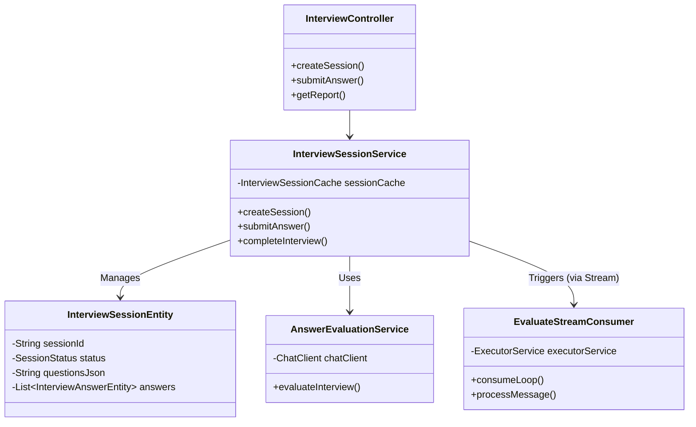
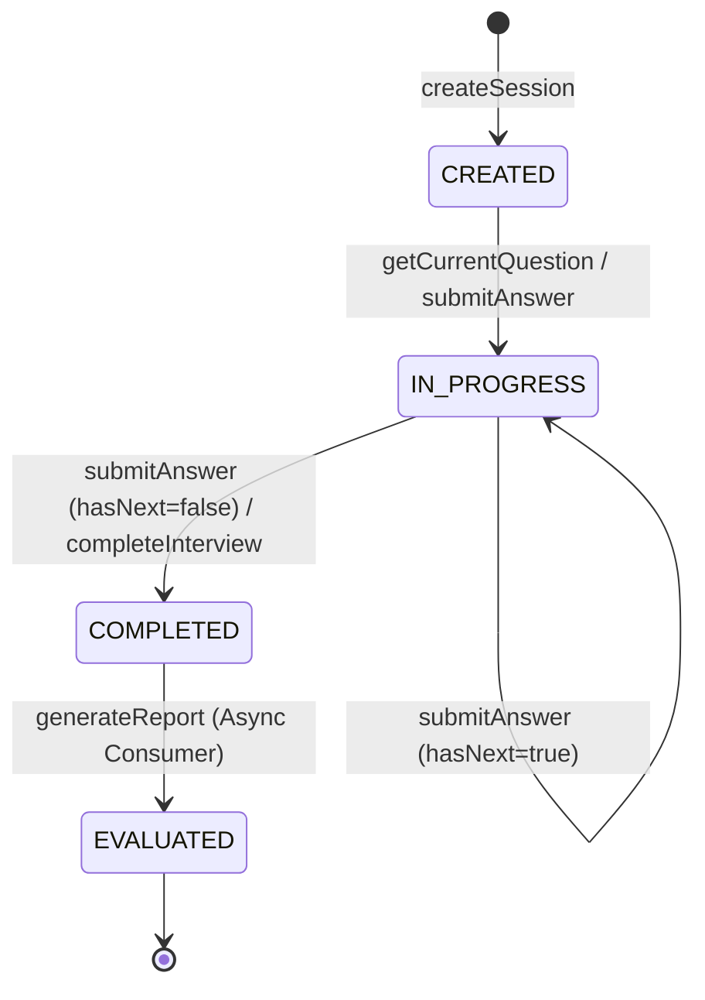

# 模拟面试模块技术文档

## 1. 架构分析

### 1.1 模块划分与组件关系

模拟面试模块采用经典的分层架构，并结合了事件驱动模式处理耗时任务（如AI评估）。

```mermaid
graph TD
    Client[客户端/前端] --> Controller[InterviewController]
    
    subgraph "Core Service Layer"
        Controller --> SessionService[InterviewSessionService]
        Controller --> HistoryService[InterviewHistoryService]
        
        SessionService --> QuestionService[InterviewQuestionService]
        SessionService --> EvaluationService[AnswerEvaluationService]
        SessionService --> PersistenceService[InterviewPersistenceService]
    end
    
    subgraph "Data & Cache Layer"
        SessionService --> RedisCache[InterviewSessionCache (Redis)]
        PersistenceService --> DB[(Database)]
    end
    
    subgraph "Async Processing Layer"
        SessionService --> Producer[EvaluateStreamProducer]
        Producer --> RedisStream[Redis Stream]
        RedisStream --> Consumer[EvaluateStreamConsumer]
        Consumer --> EvaluationService
        Consumer --> PersistenceService
    end
```

### 1.2 核心类与接口 UML



### 1.3 数据流与控制流

1.  **创建会话**: 
    *   API 请求 -> 生成问题 (LLM/Rule) -> 存入 Redis (SessionStatus.CREATED) -> 异步落库。
2.  **答题流程**: 
    *   API 提交答案 -> 更新 Redis 缓存 (CurrentIndex++) -> 异步更新 DB -> 返回下一题。
3.  **评估流程**:
    *   提交最后一题/提前交卷 -> 更新状态 (COMPLETED) -> 发送消息至 Redis Stream -> Consumer 收到消息 -> 调用 LLM 评估 -> 生成报告 -> 落库 -> 更新状态 (EVALUATED)。

---

## 2. 功能实现细节

### 2.1 面试流程状态机设计

状态流转主要由 `InterviewSessionService` 控制。



*   **CREATED**: 会话初始化，问题已生成，但用户未开始。
*   **IN_PROGRESS**: 用户开始获取问题或提交答案。
*   **COMPLETED**: 所有题目回答完毕，或用户手动提前结束。此时触发异步评估。
*   **EVALUATED**: 评分完成，报告已生成。

### 2.2 题目管理机制

*   **存储**: 题目列表序列化为 JSON 存储在 `InterviewSessionEntity.questionsJson` 和 Redis 中。
*   **索引**: `currentQuestionIndex` 指针在 Redis 和 DB 中同步维护，指向当前待回答或正在回答的题目。
*   **恢复**: 支持断点续传。`getOrRestoreSession` 方法优先从 Redis 读取，未命中则从 DB 反序列化并重建缓存。

### 2.3 评分算法实现

评分逻辑封装在 [AnswerEvaluationService.java](file:///Users/yiying/dev-app/interview-guide/app/src/main/java/interview/guide/modules/interview/service/AnswerEvaluationService.java) 中。

1.  **上下文构建**: 拼接 简历摘要 + (问题 + 用户回答) 列表。
2.  **Prompt 工程**: 使用 `interview-evaluation-system.st` 和 `interview-evaluation-user.st` 模板。
3.  **LLM 调用**: 通过 Spring AI `ChatClient` 调用大模型。
4.  **结构化解析**: 使用 `BeanOutputConverter` 将 AI 的非结构化文本转换为 `EvaluationReportDTO`。
5.  **容错**: 如果用户未回答某题，代码层强制分数为 0，不依赖 AI 判定。

### 2.4 用户交互处理逻辑

*   **实时性**: 利用 Redis 缓存保证答题过程的高性能（低延迟）。
*   **防丢失**: `saveAnswer` 接口允许用户暂存答案而不进入下一题。
*   **异步反馈**: 提交最后答案后，前端轮询或等待状态变为 `EVALUATED` 以获取报告。

---
