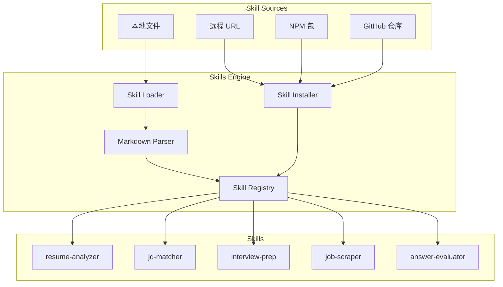

# Skills Engine

Skills 引擎是一个可插拔的 AI 能力扩展系统，允许通过 Markdown 文件定义和加载 AI 能力。

## 架构概览



## 核心组件

### 1. SkillRegistry

Skill 注册中心，负责：
- 注册和注销 Skills
- 执行 Skills
- 统计执行数据

```typescript
// 注册 Skill
registry.register(skill);

// 执行 Skill
const result = await registry.execute('skill-name', context);

// 获取所有 Skills
const skills = registry.getDefinitions();

// 获取执行统计
const stats = registry.getStats('skill-name');
```

### 2. SkillLoader

从目录加载 Skills：
- 扫描指定目录
- 解析 Markdown 文件
- 注册到 Registry

```typescript
// 从目录加载
const loader = new SkillLoader(registry, logger);
await loader.loadSkillsFromDirectory('./skills');

// 从单个文件加载
await loader.loadSkillFromFile('./skills/my-skill.md');
```

### 3. SkillMarkdownParser

解析 Markdown 格式的 Skill 定义：
- 提取 YAML frontmatter
- 解析输入/输出定义
- 提取 prompt 模板

```typescript
const parser = new SkillMarkdownParser(logger);
const definition = parser.parse(markdownContent);
```

### 4. SkillInstallerService

从远程源安装 Skills：
- URL 下载
- NPM 包安装
- GitHub 仓库克隆

```typescript
// 从 URL 安装
await installer.installFromUrl('https://example.com/skill.md');

// 从 NPM 安装
await installer.installFromNpm('@intervai/skill-name');

// 从 GitHub 安装
await installer.installFromGitHub('user/repo');
```

## Skill 定义格式

### Markdown 格式

```markdown
---
name: skill-name
version: 1.0.0
description: Skill description
author: Author Name
tags: [tag1, tag2]
inputs:
  inputName:
    type: string
    required: true
    description: Input description
    default: default value
outputs:
  type: object
  description: Output description
timeout: 30000
retryConfig:
  maxRetries: 3
  backoffMs: 1000
rateLimit:
  maxCalls: 100
  windowMs: 60000
---

# System Prompt

Your skill's prompt template goes here. Use {{inputName}} for variable substitution.

## Instructions

1. Step one
2. Step two
3. Step three

## Output Format

```json
{
  "field1": "value1",
  "field2": "value2"
}
```
```

### 字段说明

| 字段 | 类型 | 必填 | 说明 |
|------|------|------|------|
| `name` | string | 是 | Skill 唯一标识符 |
| `version` | string | 是 | 版本号 (semver) |
| `description` | string | 是 | 描述 |
| `author` | string | 否 | 作者 |
| `tags` | string[] | 否 | 标签 |
| `inputs` | object | 是 | 输入定义 |
| `outputs` | object | 否 | 输出定义 |
| `timeout` | number | 否 | 超时时间 (ms) |
| `retryConfig` | object | 否 | 重试配置 |
| `rateLimit` | object | 否 | 限流配置 |

### 输入定义

```yaml
inputs:
  resumeText:
    type: string
    required: true
    description: The resume text to analyze
  targetJob:
    type: string
    required: false
    description: Target job description
    default: Software Engineer
```

支持的类型：
- `string` - 字符串
- `number` - 数字
- `boolean` - 布尔值
- `object` - 对象
- `array` - 数组

## 内置 Skills

### 核心业务 Skills

| Skill | 描述 | 使用场景 |
|-------|------|----------|
| resume-analyzer | 解析简历并提取结构化信息 | 简历上传、技能分析 |
| resume-writer | 生成优化的简历内容 | 简历优化、内容重写 |
| jd-matcher | 匹配职位描述与简历 | 职位匹配、优化建议 |
| job-parser | 解析原始职位数据 | 职位聚合、数据标准化 |
| job-scraper | 从网页提取职位信息 | 职位抓取、数据采集 |
| interview-prep | 生成面试准备材料 | 面试准备、问题预测 |
| interview-question-generator | 生成针对性面试问题 | 面试练习、问题准备 |
| answer-evaluator | 评估面试回答 | 模拟面试反馈、回答优化 |

### 扩展 Skills

| Skill | 描述 | 使用场景 |
|-------|------|----------|
| career-advisor | 提供个性化职业发展建议 | 职业规划、发展路径 |
| salary-analyzer | 分析薪资数据并提供谈判指导 | 薪资谈判、市场分析 |
| company-researcher | 研究公司并提供面试洞察 | 公司调研、面试准备 |
| skill-analyzer | 分析技能差距并提供学习建议 | 技能发展、学习规划 |
| cover-letter-writer | 生成个性化求职信 | 求职申请、文书撰写 |
| linkedin-optimizer | 优化 LinkedIn 个人资料 | 职业社交、个人品牌 |

### Skill 详细说明

#### resume-analyzer
解析简历并提取结构化信息，包括技能、经验和教育背景。

**输入**:
- `resumeText` (string, required) - 简历文本
- `targetJob` (string, optional) - 目标职位描述

**输出**:
```json
{
  "personalInfo": { "name": "...", "email": "..." },
  "skills": { "technical": [...], "soft": [...] },
  "experience": [...],
  "education": [...],
  "matchAnalysis": { "score": 85, "gaps": [...] }
}
```

#### jd-matcher
匹配职位描述与简历，提供兼容性分析。

**输入**:
- `jobDescription` (string, required) - 职位描述
- `resumeText` (string, required) - 简历文本
- `matchDepth` (string, optional) - 分析深度: quick/standard/detailed

**输出**:
```json
{
  "overallScore": 0.85,
  "breakdown": {
    "skills": { "score": 0.9, "matched": [...], "missing": [...] },
    "experience": { "score": 0.8, "relevantExperience": [...] }
  },
  "recommendations": [...]
}
```

#### interview-prep
生成面试准备材料。

**输入**:
- `jobDescription` (string, required) - 职位描述
- `resumeText` (string, required) - 简历文本
- `interviewType` (string, optional) - 面试类型: technical/behavioral/case/panel

**输出**:
```json
{
  "technicalQuestions": [...],
  "behavioralQuestions": [...],
  "personalPitch": { "introduction": "...", "keyPoints": [...] },
  "questionsToAsk": [...]
}
```

#### job-parser
解析原始职位数据并提取结构化信息。

**输入**:
- `rawJob` (object, required) - 原始职位数据

**输出**:
```json
{
  "title": "...",
  "company": "...",
  "location": { "city": "...", "remote": true },
  "requirements": { "required": [...], "preferred": [...] },
  "skills": { "technical": [...], "soft": [...] }
}
```

#### career-advisor
提供个性化职业发展建议。

**输入**:
- `userProfile` (object, required) - 用户档案
- `careerGoal` (string, optional) - 职业目标
- `question` (string, optional) - 具体问题

**输出**:
```json
{
  "assessment": { "currentLevel": "mid", "strengths": [...] },
  "gapAnalysis": { "skillsGap": [...] },
  "recommendations": { "immediate": [...], "shortTerm": [...] },
  "careerPath": { "options": [...], "recommendedPath": "..." }
}
```

#### salary-analyzer
分析薪资数据并提供谈判指导。

**输入**:
- `jobTitle` (string, required) - 职位名称
- `location` (string, optional) - 工作地点
- `experience` (object, optional) - 经验信息
- `currentOffer` (object, optional) - 当前 Offer

**输出**:
```json
{
  "marketAnalysis": { "baseSalary": { "min": 80000, "max": 120000 } },
  "negotiation": { "targetRange": {...}, "strategy": {...} },
  "recommendations": [...]
}
```

## 使用示例

### 在服务中执行 Skill

```typescript
@Injectable()
export class ResumeService {
  constructor(private readonly aiService: AIService) {}

  async analyzeResume(resumeText: string, userId: string) {
    const result = await this.aiService.executeSkill(
      'resume-analyzer',
      { resumeText },
      userId
    );

    if (!result.success) {
      throw new Error(result.error.message);
    }

    return result.data;
  }
}
```

### 获取可用 Skills

```typescript
const skills = this.aiService.getSkills();
// [
//   { name: 'resume-analyzer', description: '...', version: '1.0.0' },
//   { name: 'jd-matcher', description: '...', version: '1.0.0' },
//   ...
// ]
```

### 动态加载 Skill

```typescript
// 从文件加载
await this.skillLoader.loadSkillFromFile('/path/to/skill.md');

// 从目录加载
await this.skillLoader.loadSkillsFromDirectory('/path/to/skills');

// 从远程安装
await this.skillInstaller.installFromUrl('https://example.com/skill.md');
```

## 配置

### 环境变量

| 变量 | 默认值 | 说明 |
|------|--------|------|
| `SKILLS_DIR` | `skills/` | Skills 目录路径 |
| `BUILTIN_SKILLS_DIR` | `skills/builtin/` | 内置 Skills 目录 |
| `ENABLE_REMOTE_SKILLS` | `true` | 启用远程安装 |
| `CACHE_SKILLS` | `true` | 缓存 Skills |
| `SKILLS_CACHE_DIR` | `.intervai/skills` | 缓存目录 |

### 模块配置

```typescript
@Module({
  imports: [
    AIModule.forRoot({
      skillsDir: process.env.SKILLS_DIR || 'skills',
      enableRemoteSkills: true,
      cacheSkills: true,
    }),
  ],
})
export class AppModule {}
```

## 最佳实践

### 1. Skill 命名

- 使用 kebab-case: `resume-analyzer`
- 描述性名称: `jd-matcher` 而非 `matcher`
- 避免缩写: `interview-prep` 而非 `int-prep`

### 2. 输入验证

```yaml
inputs:
  email:
    type: string
    required: true
    pattern: ^[a-zA-Z0-9._%+-]+@[a-zA-Z0-9.-]+\.[a-zA-Z]{2,}$
    description: Valid email address
```

### 3. Prompt 设计

```markdown
# Role

You are an expert resume analyst...

## Context

{{resumeText}}

## Task

Analyze the resume and extract...

## Output Format

Return a JSON object with...
```

### 4. 错误处理

```typescript
const result = await aiService.executeSkill('skill-name', inputs, userId);

if (!result.success) {
  switch (result.error.code) {
    case 'SKILL_NOT_FOUND':
      // Handle missing skill
      break;
    case 'INVALID_INPUTS':
      // Handle validation errors
      break;
    case 'EXECUTION_ERROR':
      // Handle execution failure
      break;
  }
}
```

## 扩展开发

### 自定义 Skill 类

对于复杂逻辑，可以创建自定义 Skill 类：

```typescript
// skills/custom-skill.ts
import { Skill, SkillContext, SkillResult } from '@/core/ai/skills';

@Skill({
  name: 'custom-skill',
  version: '1.0.0',
  description: 'Custom skill with complex logic',
})
export class CustomSkill {
  async execute(context: SkillContext): Promise<SkillResult> {
    // Custom implementation
    return {
      success: true,
      data: { /* ... */ },
    };
  }
}
```

### 注册自定义 Skill

```typescript
// In module initialization
this.skillRegistry.registerClass(CustomSkill);
```
