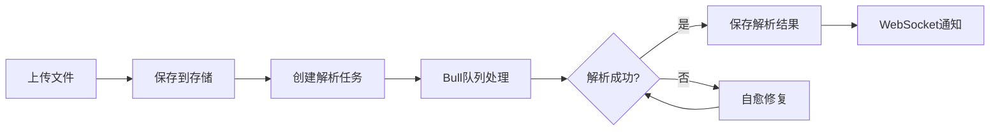

# Resume 模块 (简历管理)

简历上传、解析、存储的核心模块，支持多种文件格式和异步处理。

## 目录结构

```
resume/
├── controllers/           # API 控制器
├── dto/                   # 数据传输对象
├── services/              # 核心服务
│   ├── resume.service.ts
│   ├── resume-parser.service.ts
│   └── ...
└── resume.module.ts       # 模块配置
```

## 核心功能

### 1. 文件上传

- 支持格式：PDF, DOCX, TXT
- 分片上传支持大文件
- MD5 去重检测
- 文件大小限制配置

### 2. 简历解析

- **异步队列处理** (Bull + Redis)
- **自愈式 JSON 解析** - 自动修复 AI 输出的非标 JSON
- **结构化数据提取**：
  - 个人信息
  - 工作经历
  - 教育背景
  - 技能列表
  - 项目经验

### 3. 版本控制

- 每次优化保存新版本
- 支持版本回退
- 版本对比功能

## API 端点

```
POST   /resumes/upload              # 上传简历
GET    /resumes                     # 获取简历列表
GET    /resumes/:id                 # 获取简历详情
DELETE /resumes/:id                 # 删除简历
GET    /resumes/:id/parsed          # 获取解析结果
GET    /resumes/:id/versions        # 获取版本历史
```

## 数据模型

```prisma
model Resume {
  id              String   @id
  userId          String
  originalName    String
  filePath        String
  fileSize        Int
  mimeType        String
  md5Hash         String
  parsedContent   Json?
  status          ResumeStatus  // PENDING, PROCESSING, COMPLETED, FAILED
  createdAt       DateTime
}
```

## 解析流程



## 与其他模块的关系

- **StorageModule** - 文件存储服务
- **AIProvidersModule** - AI 解析能力
- **ChatModule** - WebSocket 状态推送
- **TasksModule** - 后台队列任务

## 配置项

```env
# 文件上传限制
MAX_FILE_SIZE=10485760    # 10MB
ALLOWED_MIME_TYPES=application/pdf,application/vnd.openxmlformats-officedocument.wordprocessingml.document

# 解析超时
PARSE_TIMEOUT=120000      # 120秒
```
